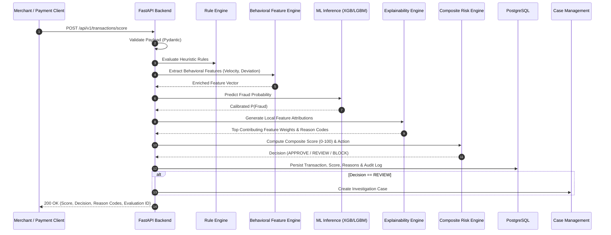
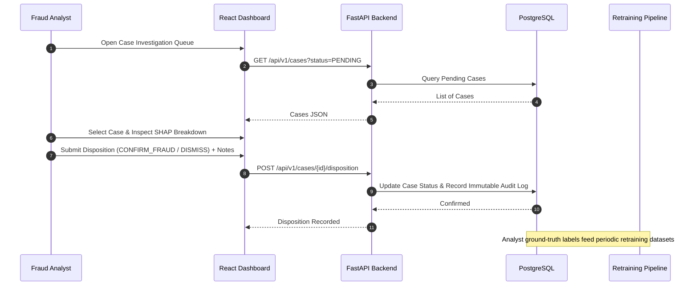
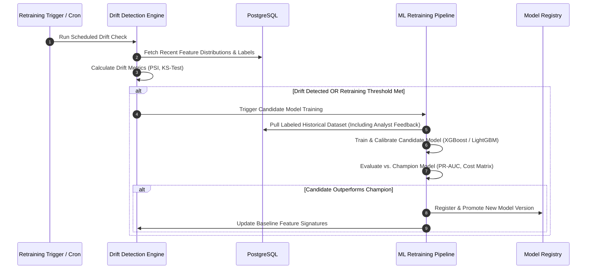

# ARCHITECTURE.md — System Architecture & Component Design

> **Platform:** AI-Powered Fraud Detection & Risk Intelligence Platform  
> **Status:** Architectural Foundation (Phase 0)  

---

## 1. System Topology Overview

The platform uses a modular, decoupled architecture where transactional data flows through validation, stateful behavioral feature computation, deterministic rule checks, machine learning inference, explainability attribution, composite risk decisioning, and persistent storage.

```
                                 ┌─────────────────────────────────┐
                                 │   Upstream Payment / Client     │
                                 └────────────────┬────────────────┘
                                                  │ (HTTP POST /api/v1/transactions/score)
                                                  ▼
┌──────────────────────────────────────────────────────────────────────────────────────────────────┐
│                                       FASTAPI SERVICE LAYER                                      │
│                                                                                                  │
│  ┌─────────────────────────┐     ┌───────────────────────────┐     ┌──────────────────────────┐  │
│  │   Request Validation    │────►│  Rule Engine (Heuristics) │────►│  Security & Rate Limit   │  │
│  │     (Pydantic v2)       │     │ (Blacklist, Sanctions)    │     │   (JWT / Auth Guard)     │  │
│  └─────────────────────────┘     └──────────────┬────────────┘     └──────────────────────────┘  │
│                                                 │                                                │
│                                                 ▼                                                │
│  ┌────────────────────────────────────────────────────────────────────────────────────────────┐  │
│  │                                    CORE RISK ENGINE                                        │  │
│  │                                                                                            │  │
│  │  ┌───────────────────────┐    ┌────────────────────────┐    ┌───────────────────────────┐  │  │
│  │  │ Behavioral Feature    │───►│ ML Inference Engine    │───►│ Explainability Engine     │  │  │
│  │  │ Extractor (Velocity)  │    │ (XGBoost / LightGBM)   │    │ (TreeSHAP Reason Codes)   │  │  │
│  │  └───────────────────────┘    └────────────────────────┘    └─────────────┬─────────────┘  │  │
│  │                                                                           │                │  │
│  │                                                                           ▼                │  │
│  │                               ┌─────────────────────────────────────────────────────────┐  │  │
│  │                               │ Composite Risk Calculator & Decision Policy Generator   │  │  │
│  │                               │   [ 0-100 Score  -->  APPROVE | REVIEW | BLOCK ]        │  │  │
│  │                               └───────────────────────────┬─────────────────────────────┘  │  │
│  └───────────────────────────────────────────────────────────┼────────────────────────────────┘  │
└──────────────────────────────────────────────────────────────┼───────────────────────────────────┘
                                                               │
                                  ┌────────────────────────────┴────────────────────────────┐
                                  ▼                                                         ▼
                 ┌─────────────────────────────────┐                       ┌─────────────────────────────────┐
                 │       PostgreSQL Database       │                       │   React + TypeScript Frontend   │
                 │                                 │                       │                                 │
                 │ • Transactions & Risk Audits    │                       │ • Real-Time Transaction Stream  │
                 │ • Analyst Cases & Dispositions  │◄──────────────────────│ • Case Investigation Queue      │
                 │ • Account History & Rules       │ (Analyst Feedback)    │ • Explainability Waterfall UI   │
                 └────────────────┬────────────────┘                       └─────────────────────────────────┘
                                  │
                                  ▼
                 ┌─────────────────────────────────┐
                 │       MLOps & Monitoring        │
                 │                                 │
                 │ • Data & Concept Drift Monitors │
                 │ • Retraining Triggers & Eval    │
                 │ • Model Artifact Registry       │
                 └─────────────────────────────────┘
```

---

## 2. Major Components & Responsibilities

### 2.1 API Gateway & Backend Services (`backend/`)
- **Router / Endpoints**: Entry point for API consumers to submit transaction evaluation requests and for analysts to query case queues.
- **Request Validator**: Validates payloads against strict Pydantic schemas (types, bounds, formatting).
- **Service Coordinator**: Orchestrates sequential execution across the Feature Extractor, Rule Engine, ML Model, Explainability Service, and Persistence Layer.

### 2.2 Behavioral Feature Engineering (`ml/features/`)
- **Stateful Velocity Aggregators**: Computes sliding-window aggregates (e.g., transaction count and sum in past 1h, 6h, 24h).
- **Statistical Deviation**: Calculates normalized $Z$-scores against user historical transaction distributions.
- **Geo / Device Anomaly Detectors**: Computes haversine distance and implied travel speed between sequential transactions for a cardholder.

### 2.3 Rule Engine (`backend/app/services/rules/`)
- **Deterministic Hard Overrides**:
  - Instant `BLOCK` for known compromised card tokens, blacklisted IPs, or sanctioned countries.
  - Instant `REVIEW` for unverified high-value international transfers.
- Rules execute in parallel with or prior to ML scoring to ensure absolute compliance boundaries.

### 2.4 ML Inference & Explainability Engines (`ml/models/`, `ml/explainability/`)
- **Inference Engine**: Executes serialized gradient-boosted decision trees (XGBoost / LightGBM) to produce calibrated posterior fraud probabilities $P(\text{Fraud} \mid X)$.
- **TreeSHAP Explainer**: Computes local feature attribution values ($\phi_i$) for the transaction.
- **Reason Code Generator**: Translates top positive feature contributions into standardized human-readable strings (e.g., `["VELOCITY_BURST_1H", "HIGH_AMOUNT_ZSCORE"]`).

### 2.5 Composite Risk Calculator (`backend/app/services/risk/`)
- Transforms raw calibrated probabilities $P \in [0, 1]$ and rule adjustments into an intuitive integer score $S \in [0, 100]$.
- Applies decision thresholds:
  - **Score $< 35$**: `APPROVE`
  - **$35 \le \text{Score} < 75$**: `REVIEW` (creates a case in PostgreSQL)
  - **Score $\ge 75$**: `BLOCK`

### 2.6 Persistence Layer (`database/`)
- **PostgreSQL**: Relational storage for transactions, audit logs, risk scores, rule triggers, and human case reviews.
- Provides strict ACID guarantees for case assignment and state transitions.

### 2.7 Fraud Analyst Dashboard (`frontend/`)
- React + TypeScript interface for operations analysts.
- Real-time transaction monitoring, filterable case queue, detailed transaction inspector with SHAP feature contribution charts, and one-click disposition controls.

### 2.8 MLOps & Monitoring (`ml/monitoring/`, `ml/retraining/`)
- **Drift Intelligence**: Tracks statistical distance (e.g., Population Stability Index [PSI], Kolmogorov-Smirnov test) between training baseline distributions and live incoming transaction features.
- **Retraining Pipeline**: Evaluates candidate models on holdout validation datasets against active champion models before promoting new artifact versions.

---

## 3. Core Data Flows

### 3.1 Real-Time Transaction Risk Evaluation Flow



---

### 3.2 Human Review & Analyst Feedback Loop



---

### 3.3 Drift Monitoring & Model Retraining Flow



---

## 4. Key Architectural Principles

1. **Separation of Concerns**: ML feature computation, heuristic rule evaluation, model scoring, and persistence are decoupled into modular modules.
2. **Measurable Non-Functional Requirements**: Latency and throughput are tracked via explicit profiling hooks without premature architectural bloat.
3. **Defense-in-Depth Risk Scoring**: Combining deterministic compliance rules with probabilistic ML inference ensures both strict adherence to legal policies and high sensitivity to complex fraud patterns.
4. **Explainability by Design**: Every non-approved transaction carries defensible reason codes and local feature attributions for compliance and human investigator clarity.
5. **Human-in-the-Loop Feedback**: Analyst dispositions directly enrich training datasets, forming a virtuous cycle of continuous model improvement.
6. **Security & Zero Hardcoded Secrets**: Complete configuration via `.env`, strict type validation, and immutable audit logging across all decision points.
