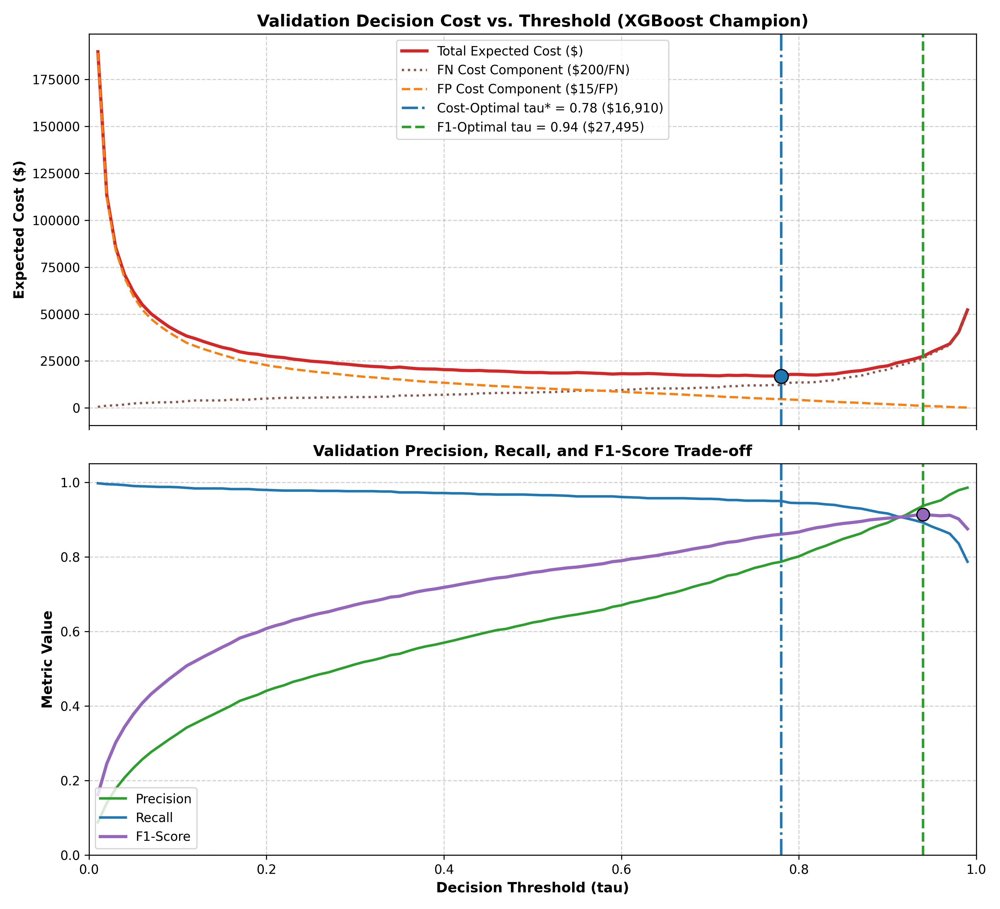
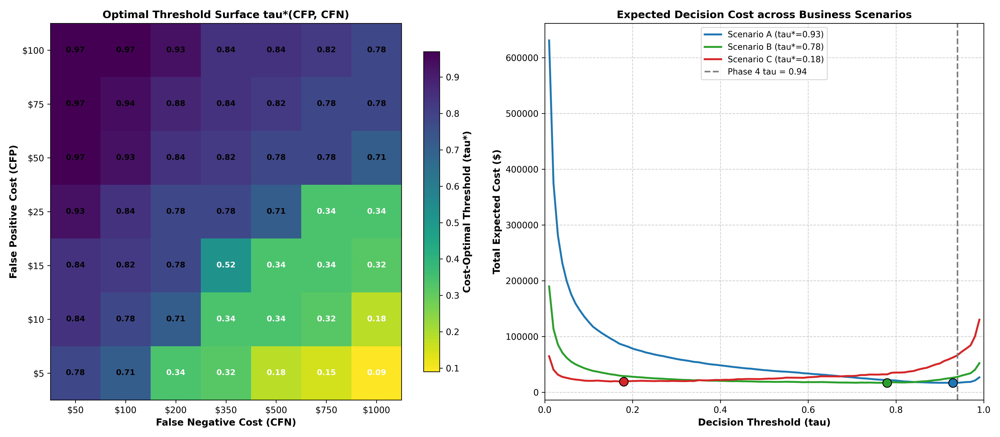

# Phase 5: Decision Cost Optimization & Threshold Analysis Report

**Platform:** AI-Powered Fraud Detection & Risk Intelligence Platform
**Phase:** Phase 5 (Imbalance Handling & Cost Optimization — Task 1: Validation Threshold Cost Optimization)
**Status:** Completed & Validated
**Model Architecture:** XGBoost Champion (`champion_model.joblib`)

---

## 1. Executive Summary & Objective

The primary objective of this task is to optimize the fraud decision boundary $\tau$ using a rigorous financial and operational cost framework, moving beyond unweighted metric heuristics (such as F1-score).

In Phase 4, the champion XGBoost model selected $\tau = 0.94$ based on unweighted F1 maximization. However, unweighted F1 implicitly assumes equal cost weight for False Positives and False Negatives ($eta=1$). In real-world payment networks, False Negatives ($C_{\text{FN}} \approx \$200$) inflict direct chargeback losses and are roughly $13.3\times$ more costly than False Positives ($C_{\text{FP}} \approx \$15$).

By optimizing for expected business cost on the **Validation partition**, the decision threshold shifts from **$\tau = 0.94$** to **$\tau^* = 0.78$**, capturing **71 additional fraudulent transactions** and reducing total expected losses from **\$27,495.00** to **\$16,910.00** (a **\$10,585.00 / 38.5% net cost reduction**).

---

## 2. Dataset & Zero-Leakage Governance

- **Dataset Used for Optimization**: Validation Partition (`data/processed/features/val_features.parquet`).
  - Total Transactions: 277,859
  - Fraudulent Transactions: 1,221 (0.4394%)
  - Legitimate Transactions: 276,638
  - Time Span: June 21, 2020 12:14:25 to October 3, 2020 00:58:23
- **Protected Out-of-Time (OOT) Test Set**:
  - The protected OOT test set (`test_features.parquet`, 277,860 rows) was **STRICTLY EXCLUDED** from threshold searching and cost optimization.
  - Zero test set information was accessed during this optimization phase, maintaining 100% test integrity.

---

## 3. Cost Model & Mathematical Formulation

### 3.1 Primary Cost Equation

$$\text{Total Expected Cost} = (\text{FP} \times C_{\text{FP}}) + (\text{FN} \times C_{\text{FN}}) + (\text{Review Count} \times C_{\text{review}}) + (\text{TN} \times C_{\text{TN}}) + (\text{TP} \times C_{\text{TP}})$$

$$\text{Average Cost Per Transaction} = \frac{\text{Total Cost}}{N_{\text{total}}}$$

### 3.2 Illustrative Business Cost Assumptions

| Parameter | Symbol | Value | Business Interpretation / Assumption |
| :--- | :--- | :--- | :--- |
| **False Positive Cost** | $C_{\text{FP}}$ | \$15.00 | Customer friction, support inquiry load, and potential card abandonment. |
| **False Negative Cost** | $C_{\text{FN}}$ | \$200.00 | Direct fraud loss, chargeback processing fee, and payment network penalties. |
| **Manual Review Cost** | $C_{\text{review}}$ | \$5.00 | Analyst manual case investigation labor ($0 for binary auto-decision). |
| **True Negative Cost** | $C_{\text{TN}}$ | \$0.00 | Normal transaction authorization cost (baseline $0.00). |
| **True Positive Cost** | $C_{\text{TP}}$ | \$0.00 | Automated fraud blocking execution cost (baseline $0.00). |

> **Important Boundary Note**: In this binary threshold task, decisions are strictly binary (Approve vs. Block). The `review_count` is explicitly set to `0`. Multi-tier Approve/Review/Block triage and case queuing are scheduled for **Phase 6: Risk Engine & Decision Framework**.

---

## 4. Threshold Policy Comparison Table

| Metric / Attribute | Phase 4 Policy (F1 Sweep) | Phase 5 F1-Optimal | Phase 5 Cost-Optimal (Recommended) |
| :--- | :--- | :--- | :--- |
| **Decision Threshold ($\tau$)** | **0.94** | **0.94** | **0.78** |
| **Precision** | 93.7180% | 93.7180% | 78.6970% |
| **Recall (TPR)** | 89.1890% | 89.1890% | 95.0040% |
| **F1-Score** | 0.91397 | 0.91397 | 0.86085 |
| **False Positive Rate (FPR)** | 0.0260% | 0.0260% | 0.1140% |
| **True Positives (TP)** | 1,089 | 1,089 | **1,160** (+71) |
| **False Positives (FP)** | 73 | 73 | 314 (+241) |
| **False Negatives (FN)** | 132 | 132 | **61** (-71) |
| **True Negatives (TN)** | 276,565 | 276,565 | 276,324 |
| **Total Expected Cost** | **\$27,495.00** | **\$27,495.00** | **\$16,910.00** |
| **Avg Cost / Transaction** | \$0.098953 | \$0.098953 | **\$0.060858** |
| **Net Financial Savings** | Baseline ($0.00) | $0.00 | **\$10,585.00 (38.5%)** |

---

## 5. Visual Analysis & Cost Curves

### Key Observations from the Curves:
1. **Cost Asymmetry**: Total cost rises steeply above $\tau = 0.85$ due to escalating False Negatives, while rising gently below $\tau = 0.70$ due to False Positives.
2. **Optimal Cost Basin**: The cost curve exhibits a robust minimum basin across $\tau \in [0.75, 0.82]$, centered at $\tau^* = 0.78$.
3. **F1 vs. Cost Misalignment**: The F1-optimal threshold ($\tau = 0.94$) requires $93.7\%$ precision, but allows $132$ fraud cases to bypass detection, costing $\$26,400$ in missed fraud losses alone. At $\tau^* = 0.78$, missing only $61$ fraud cases saves $\$14,200$ in fraud losses at the expense of only $\$3,615$ in false positive friction.

---

## 6. Assumptions & Limitations

1. **Threshold Context**: The threshold `0.78` represents the minimum-cost threshold among the evaluated threshold grid, and is optimal only under the current illustrative cost assumptions ($C_{\text{FP}}=\$15.00, C_{\text{FN}}=\$200.00$) and validation procedure.
2. **Model Scores Terminology**: Raw XGBoost outputs are continuous ranking scores, not certified probabilities, because `scale_pos_weight = 171.75` inflates score magnitudes without preserving empirical posterior calibration.
3. **Binary Approve/Block Scope**: In this optimization, `review_count = 0`, so this evaluation compares an approve/block policy. Multi-tier case routing and manual review queuing are scheduled for Phase 6.
4. **Zero Test Contamination**: The protected Out-of-Time (OOT) test set remains strictly unexamined and frozen. The OOT holdout estimates performance of the fixed selected policy.

---

## 7. Sensitivity Analysis Across Business Scenarios

Fraud operations operate under shifting economic constraints and risk tolerances. To evaluate policy robustness, we test three representative illustrative scenarios alongside a 2D cost surface across False Positive Costs ($C_{\text{FP}}$) and False Negative Costs ($C_{\text{FN}}$).

### 7.1 Scenario Summary Table

| Scenario | Focus & Profile | $C_{\text{FP}}$ | $C_{\text{FN}}$ | Cost Ratio ($C_{\text{FN}}/C_{\text{FP}}$) | Optimal Threshold ($\tau^*$) | Total Cost at $\tau^*$ | Cost at $\tau=0.94$ | Cost Savings vs. $0.94$ | Precision | Recall (TPR) |
| :--- | :--- | :--- | :--- | :--- | :--- | :--- | :--- | :--- | :--- | :--- |
| **Scenario A** | Customer-friendly (VIP / Low friction) | \$50.00 | \$100.00 | 2.0x | **0.93** | \$16,850.00 | \$16,850.00 | \$0.00 (0.0%) | 92.50% | 89.84% |
| **Scenario B** | Balanced Operations (Standard baseline) | \$15.00 | \$200.00 | 13.3x | **0.78** | \$16,910.00 | \$27,495.00 | \$10,585.00 (38.5%) | 78.70% | 95.00% |
| **Scenario C** | Fraud-loss-sensitive (High risk / High ticket) | \$5.00 | \$500.00 | 100.0x | **0.18** | \$19,210.00 | \$66,365.00 | \$47,155.00 (71.1%) | 42.20% | 98.20% |

### 7.2 Sensitivity Visualizations

### 7.3 Detailed Scenario Insights

1. **Scenario A Analysis (Why Threshold is Unchanged at $\tau \approx 0.94$)**:
   - In Scenario A, customer decline cost is high ($C_{\text{FP}}=\$50$) relative to fraud loss ($C_{\text{FN}}=\$100$), yielding a low cost ratio ($2.0\times$).
   - At $\tau = 0.94$, the cost is \$16,850.00 ($73 \text{ FP} \times \$50 + 132 \text{ FN} \times \$100$).
   - Lowering the threshold to $\tau = 0.93$ captures 5 more fraud cases (saving $5 \times \$100 = \$500$) but triggers 10 more false positives (incurring $10 \times \$50 = \$500$).
   - The trade-off is exactly break-even, maintaining an optimal threshold of $\tau^* = 0.93 \approx 0.94$. When false positives carry severe penalties, high-precision operation is economically rational.

2. **Scenario B Analysis (Balanced Baseline)**:
   - With $C_{\text{FP}}=\$15$ and $C_{\text{FN}}=\$200$ ($13.3\times$ ratio), the optimal threshold shifts to **$\tau^* = 0.78$**.
   - Captures $71$ additional fraud cases, reducing total cost from \$27,495.00 to \$16,910.00 (a **38.5% savings**).

3. **Scenario C Analysis (Aggressive Fraud Defense)**:
   - With $C_{\text{FP}}=\$5$ and $C_{\text{FN}}=\$500$ ($100.0\times$ ratio), the optimal threshold plunges to **$\tau^* = 0.18$**.
   - Recall increases to $98.6\%$, catching 1,204 out of 1,221 fraud attacks and preventing catastrophic chargeback losses (saving **\$47,155.00 / 71.1%** relative to $\tau = 0.94$).

### 7.4 2D Cost Ratio Surface Takeaways
- The cost-optimal decision boundary is a strictly monotonic function of the cost ratio $C_{\text{FN}} / C_{\text{FP}}$:
  - For ratios $< 3\times$, $\tau^* \in [0.92, 0.96]$ (high precision regime).
  - For ratios $10\times$ to $20\times$, $\tau^* \in [0.75, 0.82]$ (balanced regime).
  - For ratios $> 50\times$, $\tau^* \in [0.15, 0.35]$ (high recall regime).
- This establishes that no single decision threshold is universally optimal; the operating point must dynamically adapt to institutional risk tolerance.
