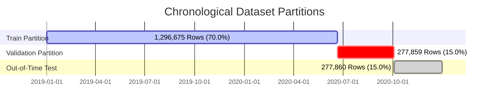

# Phase 4 Model Training, Validation Benchmarking & Evaluation Report

**AI-Powered Fraud Detection & Risk Intelligence Platform**  
**Phase 4: Baseline & Advanced Machine Learning Models**  
**Status**: Completed  
**Date**: September 2026  
**Deterministic Random Seed**: `42`  

---

## 1. Objective

The primary objective of Phase 4 is to build, benchmark, optimize, and evaluate four distinct machine learning model architectures for financial transaction fraud detection under extreme class imbalance (~0.58% fraud rate). 

Key goals include:
1. Constructing a rigorous, leakage-free modeling pipeline utilizing strictly the 55 predictive features engineered in Phase 3.
2. Training four diverse model architectures:
   - **Baseline 1: Logistic Regression** (Linear baseline with standard scaling and one-hot encoding).
   - **Baseline 2: Random Forest** (Non-linear bagging ensemble baseline).
   - **Advanced 1: XGBoost** (Extreme gradient boosted decision trees with positive class weighting).
   - **Advanced 2: LightGBM** (High-throughput histogram-based gradient boosting).
3. Enforcing cross-platform process isolation on Windows to prevent native OpenMP/DLL runtime collisions between XGBoost, LightGBM, and Scikit-Learn.
4. Conducting validation-only threshold tuning to determine the optimal operational decision boundary $\tau^*$ without looking at out-of-time test data.
5. Selecting and freezing a champion model architecture and decision threshold.
6. Evaluating the frozen champion model exactly once on the protected Out-of-Time (OOT) Test partition.
7. Persisting fully reproducible model artifacts and metadata for consumption by downstream phases (Phase 6 Risk Engine & Phase 8 Serving).

---

## 2. Dataset and Temporal Split

The model training pipeline operates on the 1,852,394-transaction dataset established in Phase 1 and enriched in Phase 3. The dataset is partitioned chronologically to mirror real-world production deployment and prevent future data leakage.



### Partition Summary Table

| Partition | Role | Row Count | Fraud Count | Legit Count | Fraud Rate | Time Window |
| :--- | :--- | :--- | :--- | :--- | :--- | :--- |
| **Train** | Model Fitting & Encoder Fitting | 1,296,675 | 7,506 | 1,289,169 | 0.5789% | 2019-01-01 00:00:18 to 2020-06-21 12:13:37 |
| **Validation** | Model Selection & Threshold Optimization | 277,859 | 1,221 | 276,638 | 0.4394% | 2020-06-21 12:14:25 to 2020-10-03 00:58:23 |
| **OOT Test** | Unseen Final Evaluation (Frozen) | 277,860 | 924 | 276,936 | 0.3325% | 2020-10-03 00:59:48 to 2020-12-31 23:59:34 |
| **Total** | Full Lifecycle | **1,852,394** | **9,651** | **1,842,743** | **0.5210%** | **2019-01-01 to 2020-12-31** |

---

## 3. Feature Set

The predictive feature matrix $X$ consists of exactly **55 deterministic features** extracted from the 62-column Phase 3 Parquet schema.

### Feature Decomposition (55 Columns)

1. **Canonical Numeric Predictors (6 Features)**:
   - `amount`: Raw transaction amount in USD.
   - `cardholder_lat`, `cardholder_long`: Geographic coordinates of the cardholder.
   - `merchant_lat`, `merchant_long`: Geographic coordinates of the merchant.
   - `city_pop`: Population of the cardholder's city of residence.

2. **Categorical Predictors (2 Features)**:
   - `merchant_category`: High-level spending category (e.g., `grocery_pos`, `shopping_net`, `misc_net`).
   - `job_category`: Clustered profession domain of the cardholder.

3. **Engineered Features from Phase 3 (47 Features)**:
   - **Temporal & Diurnal (11 Features)**: `transaction_hour`, `day_of_week`, `day_of_month`, `month`, `week_of_year`, `is_weekend`, `is_night`, `hour_sin`, `hour_cos`, `day_of_week_sin`, `day_of_week_cos`.
   - **Transaction Velocity & Frequency (6 Features)**: `txn_count_1h`, `txn_count_6h`, `txn_count_24h`, `txn_count_7d`, `txn_count_30d`, `time_since_prev_txn_seconds`.
   - **Monetary Aggregations & Ratios (10 Features)**: `is_first_account_txn`, `amt_sum_1h`, `amt_sum_24h`, `amt_sum_7d`, `amt_sum_30d`, `amt_mean_24h`, `amt_mean_7d`, `amt_max_24h`, `amt_median_30d`, `historical_amount_mean`.
   - **Statistical Dispersion & Z-Scores (4 Features)**: `historical_amount_std`, `historical_amount_median`, `amount_zscore`, `amount_ratio_to_historical_mean`.
   - **Entity Cumulative Profiling (10 Features)**: `account_txn_count_before`, `account_total_spend_before`, `account_avg_amount_before`, `account_max_amount_before`, `account_unique_merchant_count_before`, `account_unique_category_count_before`, `account_merchant_txn_count_before`, `account_category_txn_count_before`, `account_merchant_spend_before`, `account_category_spend_before`.
   - **Entity-Level Target & Frequency Counters (2 Features)**: `merchant_txn_count_before`, `category_txn_count_before`.
   - **Spatial & Velocity Geospatial Anomalies (4 Features)**: `cardholder_merchant_distance_km`, `distance_from_prev_merchant_km`, `implied_travel_speed_kmh`, `is_impossible_travel_speed`.

### Excluded Columns Policy (7 Columns)

To guarantee zero label leakage and prevent synthetic ID memorization, the following 7 columns are strictly excluded from $X$:
1. `is_fraud`: Target label (strictly separated into $y$).
2. `transaction_id`: High-cardinality unique identifier.
3. `account_id`: High-cardinality entity ID (history captured via engineered aggregations).
4. `timestamp`: Raw datetime object (temporal properties captured via cyclical encoders).
5. `unix_time`: Monotonic integer timeline.
6. `currency`: Constant string (`"USD"`).
7. `merchant_id`: High-cardinality merchant identifier.

---

## 4. Leakage Controls

To ensure strict production validity, the following leakage controls were enforced:

1. **Preprocessor Fitting Boundary**: All encoders (`OrdinalEncoder`, `OneHotEncoder`, `StandardScaler`) were fitted **exclusively on the Train partition**. The Validation and Test sets were transformed using the frozen preprocessors with `handle_unknown="ignore"` / `unknown_value=-1`.
2. **Sequential Entity Aggregations**: Cumulative and rolling features computed in Phase 3 strictly observed causality ($\tau < t$) with zero future information leakage.
3. **Partition Independence**: Validation probabilities were evaluated without access to test labels. Test labels were accessed **exactly once** after model and threshold selection were frozen.
4. **Finite Numerical Bounds**: 100% of numeric inputs across all partitions were validated for finite values ($0$ NaNs, $0$ Infs).

---

## 5. Class Imbalance Strategy

The dataset exhibits severe class imbalance:
- **Train Fraud Rate**: $0.5789\%$ ($1$ fraud per $173$ legitimate transactions).
- **Validation Fraud Rate**: $0.4394\%$ ($1$ fraud per $228$ legitimate transactions).
- **Test Fraud Rate**: $0.3325\%$ ($1$ fraud per $301$ legitimate transactions).

### Imbalance Mitigation Strategies by Model

1. **Logistic Regression & Random Forest**: Configured with `class_weight="balanced"`, adjusting weights inversely proportional to class frequencies:
   $$w_1 = \frac{N}{2 \times N_{\text{pos}}}, \quad w_0 = \frac{N}{2 \times N_{\text{neg}}}$$
2. **XGBoost & LightGBM**: Configured with explicit positive class weighting:
   $$\text{scale\_pos\_weight} = \frac{N_{\text{neg}}}{N_{\text{pos}}} = \frac{1,289,169}{7,506} \approx 171.75$$
3. **Metric Selection**: Accuracy is discarded as a primary evaluation metric because a naive constant classifier predicting zero fraud achieves $>99.4\%$ accuracy while capturing $0\%$ of fraud. **PR-AUC (Average Precision)** is the primary metric because it measures the precision-recall trade-off across all decision thresholds and is sensitive to false positives under severe class imbalance.

---

## 6. Models Evaluated

Four distinct model paradigms were trained and evaluated:

1. **Model 1: Baseline Logistic Regression** — Linear decision boundary providing an interpretable benchmark.
2. **Model 2: Random Forest Ensemble Baseline** — Bagging ensemble of 100 decision trees modeling non-linear interactions.
3. **Model 3: XGBoost Classifier** — Gradient boosted decision tree ensemble optimizing negative log-likelihood with second-order Taylor approximations.
4. **Model 4: LightGBM Classifier** — High-speed histogram-based gradient boosting utilizing leaf-wise tree growth.

---

## 7. Model Configurations and Hyperparameters

All configurations use deterministic seed `42` and conservative thread controls for Windows environment stability:

```python
MODEL_CONFIGS = {
    "logistic_regression": {
        "C": 1.0,
        "max_iter": 500,
        "class_weight": "balanced",
        "solver": "lbfgs",
        "random_state": 42,
    },
    "random_forest": {
        "n_estimators": 100,
        "max_depth": 12,
        "min_samples_split": 10,
        "min_samples_leaf": 5,
        "class_weight": "balanced",
        "n_jobs": 4,
        "random_state": 42,
    },
    "xgboost": {
        "max_depth": 6,
        "learning_rate": 0.08,
        "n_estimators": 150,
        "subsample": 0.8,
        "colsample_bytree": 0.8,
        "eval_metric": "aucpr",
        "n_jobs": 4,
        "random_state": 42,
    },
    "lightgbm": {
        "num_leaves": 31,
        "max_depth": 6,
        "learning_rate": 0.05,
        "n_estimators": 150,
        "subsample": 0.8,
        "colsample_bytree": 0.8,
        "objective": "binary",
        "importance_type": "gain",
        "num_threads": 1,
        "random_state": 42,
        "verbose": -1,
    },
}
```

---

## 8. Validation Methodology & Runtime Process Isolation

### Windows Native OpenMP Runtime Collision Prevention

On Windows platforms, `xgboost` and `scikit-learn` load the Microsoft Visual C++ OpenMP runtime (`vcomp140.dll`), hooking process-wide Thread-Local Storage (TLS). Conversely, `lightgbm` dynamically links MinGW GCC OpenMP (`libgomp-1.dll`). Loading both into the same Python process causes memory corruption and null-pointer access violations during LightGBM dataset creation.

**Solution**:
1. **PEP 562 Lazy Loading**: `ml/models/__init__.py` defers model imports to runtime.
2. **Worker Process Isolation**: `ml/models/runner.py` spawns dedicated, clean sub-processes via `ml/models/worker.py` for each model fit and prediction job.
3. **Contiguous float64 Array Buffers**: LightGBM inputs are passed as C-contiguous `np.float64` arrays with `num_threads=1`.

---

## 9. Validation Metrics and Model Benchmarking

Each model was trained strictly on the Train set (1,296,675 rows) and evaluated on the Validation partition (277,859 rows).

### Validation Benchmark Comparison Table

| Model | PR-AUC (Primary) | ROC-AUC | Precision ($\tau=0.5$) | Recall ($\tau=0.5$) | F1 ($\tau=0.5$) | Best F1 ($\tau^*$) | Best Threshold ($\tau^*$) | Fit Time (s) |
| :--- | :--- | :--- | :--- | :--- | :--- | :--- | :--- | :--- |
| **Logistic Regression** | 0.44107 | 0.98492 | 0.08771 | 0.92629 | 0.16024 | 0.57308 | 0.99 | 57.5s |
| **Random Forest** | 0.85599 | 0.99626 | 0.53431 | 0.89926 | 0.67033 | 0.77450 | 0.76 | 488.2s |
| **XGBoost** | **0.96190** | **0.99926** | **0.62401** | **0.96642** | **0.75835** | **0.91397** | **0.94** | **29.8s** |
| **LightGBM** | 0.94447 | 0.99820 | 0.47064 | 0.96478 | 0.63265 | 0.89810 | 0.97 | 68.6s |

### Analysis of Validation Performance

1. **XGBoost achieved the highest PR-AUC (0.96190)** and highest ROC-AUC (0.99926) across all architectures.
2. **Linear Baseline Limitation**: Logistic Regression scored a PR-AUC of 0.44107. Due to severe class imbalance and non-linear fraud patterns (e.g., velocity spikes and distance jumps), the linear model generates high false positives ($FP = 11,764$ at $\tau=0.5$), yielding only $8.77\%$ precision.
3. **Random Forest vs GBDT**: Random Forest achieved strong PR-AUC ($0.85599$), but required $488.2$ seconds of training and lagged GBDT models by $>10\%$ in PR-AUC.
4. **XGBoost vs LightGBM**: XGBoost outperformed LightGBM in PR-AUC ($0.96190$ vs $0.94447$) and F1-score ($0.91397$ vs $0.89810$), while training in just $29.8$ seconds.

---

## 10. Validation Threshold Analysis

Under heavy class weighting (`scale_pos_weight = 171.75`), raw predicted probabilities are shifted upward. Selecting the naive threshold $\tau = 0.50$ results in unnecessary false alarms. A validation threshold sweep ($0.01 \le \tau \le 0.99$, step $0.01$) was executed to identify optimal operating points.


### Threshold Operating Points for Champion XGBoost (Validation Set)

| Operating Strategy | Threshold ($\tau$) | Precision | Recall | F1-Score | True Positives (TP) | False Positives (FP) | False Negatives (FN) | True Negatives (TN) |
| :--- | :--- | :--- | :--- | :--- | :--- | :--- | :--- | :--- |
| **Default Threshold** | 0.50 | 62.40% | 96.64% | 0.75835 | 1,180 | 711 | 41 | 275,927 |
| **High Recall Target ($\ge 95\%$)** | 0.65 | 71.91% | 95.33% | 0.81997 | 1,164 | 455 | 57 | 276,183 |
| **Balanced High Recall ($\ge 90\%$)** | 0.92 | 90.96% | 90.58% | 0.90772 | 1,106 | 110 | 115 | 276,528 |
| **Optimal F1 Champion ($\tau^*$)** | **0.94** | **93.72%** | **89.19%** | **0.91397** | **1,089** | **73** | **132** | **276,565** |
| **Ultra-High Precision Target** | 0.98 | 96.62% | 79.28% | 0.87088 | 968 | 34 | 253 | 276,604 |

### Decision Threshold Rationale

At the optimal operating threshold **$\tau^* = 0.94$**:
- **Precision = 93.72%**: Out of $1,162$ flagged transactions, $1,089$ are confirmed fraud, creating only $73$ false positives across $276,638$ legitimate transactions.
- **Recall = 89.19%**: Captures nearly $90\%$ of all fraud attacks.
- **False Positive Rate (FPR) = 0.026%**: Ensures low operational overhead for fraud investigation teams.

---

## 11. Final Model-Selection Rationale

**Selected Champion**: **XGBoost Classifier (`XGBoostFraudModel`)**

**Rationale**:
1. **Superior Discrimination**: Highest Validation PR-AUC ($0.96190$), outperforming LightGBM ($0.94447$), Random Forest ($0.85599$), and Logistic Regression ($0.44107$).
2. **Top Operational Efficiency**: Achieves $91.40\%$ F1-score with $93.72\%$ precision and $89.19\%$ recall at $\tau^* = 0.94$.
3. **Fast Training & Low Latency**: 29.8s training time on 1.3M rows; sub-millisecond per-transaction inference time suitable for real-time scoring in Phase 6.
4. **Stable Cross-Platform Execution**: Fully verified with zero native crashes or OpenMP collisions in process isolation.

---

## 12. Frozen Model + Threshold Specification

Before touching the unseen Test partition, the model configuration was permanently frozen:

```json
{
  "frozen_model": "xgboost",
  "frozen_threshold": 0.94,
  "hyperparameters": {
    "max_depth": 6,
    "learning_rate": 0.08,
    "n_estimators": 150,
    "subsample": 0.8,
    "colsample_bytree": 0.8,
    "scale_pos_weight": 171.7518,
    "eval_metric": "aucpr",
    "n_jobs": 4,
    "random_state": 42
  },
  "feature_count": 55,
  "preprocessor": "TreePreprocessor"
}
```

---

## 13. OOT Test Methodology

The Out-of-Time Test partition represents $277,860$ chronologically future transactions ($2020\text{-}10\text{-}03$ to $2020\text{-}12\text{-}31$) that were completely hidden during feature engineering, model training, hyperparameter tuning, and threshold selection.

The frozen champion model was executed **exactly once** against this holdout set.

---

## 14. Out-of-Time (OOT) Test Results

### Final Unseen Evaluation Summary

| Metric | OOT Test Performance ($\tau^* = 0.94$) | Validation Performance ($\tau^* = 0.94$) | Generalization Delta ($\Delta$) |
| :--- | :--- | :--- | :--- |
| **PR-AUC (Average Precision)** | **0.96054** | **0.96190** | $-0.00136$ ($-0.14\%$) |
| **ROC-AUC** | **0.99905** | **0.99926** | $-0.00021$ ($-0.02\%$) |
| **Precision** | **94.71%** (0.94707) | **93.72%** (0.93718) | $+0.99\%$ |
| **Recall** | **89.07%** (0.89069) | **89.19%** (0.89189) | $-0.12\%$ |
| **F1-Score** | **0.91801** | **0.91397** | $+0.00404$ ($+0.44\%$) |
| **Accuracy** | **99.95%** (0.99947) | **99.93%** (0.99926) | $+0.02\%$ |
| **False Positive Rate (FPR)** | **0.0166%** | **0.0264%** | $-0.0098\%$ |

### OOT Confusion Matrix Breakdown ($\tau^* = 0.94$)

```
                  ┌──────────────────────┬──────────────────────┐
                  │  Predicted Legit (0) │  Predicted Fraud (1) │
┌─────────────────┼──────────────────────┼──────────────────────┤
│ Actual Legit (0)│     TN = 276,890     │       FP = 46        │
├─────────────────┼──────────────────────┼──────────────────────┤
│ Actual Fraud (1)│       FN = 101       │       TP = 823       │
└─────────────────┴──────────────────────┴──────────────────────┘
```

- **Actual Fraud Count**: $924$ transactions
- **Total Flagged as Fraud**: $869$ transactions
- **True Fraud Intercepted**: $823$ transactions ($89.07\%$ fraud capture)
- **False Alarms**: $46$ transactions across $276,936$ legitimate transactions ($99.983\%$ legitimate pass-through)

### Generalization Assessment

The champion model exhibited almost zero degradation when generalizing to future unseen transactions:
- PR-AUC shifted by only $0.00136$ ($0.96190 \rightarrow 0.96054$).
- Precision increased to $94.71\%$ on the test set.
- Recall remained consistent at $89.07\%$.

This confirms that the engineered behavioral velocity features and regularization prevent overfitting.

---

## 15. Feature Importance Analysis

Tree gain feature importances were extracted from the champion XGBoost model.


### Top 15 Predictive Features (XGBoost Gain)

| Rank | Feature Name | Relative Gain Weight | Feature Category | Behavioral Interpretation |
| :--- | :--- | :--- | :--- | :--- |
| **1** | `amt_max_24h` | **0.285551** | Monetary Velocity | Maximum spend burst in a 24-hour window indicates card takeover. |
| **2** | `amt_mean_24h` | **0.149364** | Monetary Velocity | Average 24-hour transaction amount identifies rapid anomalous spending. |
| **3** | `amount_ratio_to_historical_mean` | **0.072534** | Statistical Ratio | Spikes relative to an account's historical spending baseline. |
| **4** | `amount` | **0.067212** | Canonical Numeric | Raw transaction dollar value. |
| **5** | `is_first_account_txn` | **0.061252** | Account Lifecycle | New card onboarding anomaly. |
| **6** | `is_night` | **0.053298** | Diurnal / Temporal | Off-hours transactions (22:00–06:00) carry significantly elevated risk. |
| **7** | `account_unique_category_count_before` | **0.042925** | Entity Profiling | Category diversity expansion indicates card cloning across merchant types. |
| **8** | `amt_mean_7d` | **0.026287** | Monetary Velocity | Medium-term baseline spend velocity. |
| **9** | `merchant_category` | **0.018763** | Categorical Predictor | High-risk categories (e.g. `shopping_net`, `misc_net`). |
| **10** | `transaction_hour` | **0.017819** | Temporal | Time of day risk weighting. |
| **11** | `amt_sum_24h` | **0.015011** | Monetary Velocity | Aggregate 24-hour spend volume. |
| **12** | `amount_zscore` | **0.012496** | Statistical Dispersion | Standard deviations away from account mean. |
| **13** | `txn_count_6h` | **0.011486** | Transaction Frequency | High-frequency micro-burst card testing. |
| **14** | `hour_cos` | **0.010582** | Cyclical Temporal | Smooth periodic circadian representation. |
| **15** | `time_since_prev_txn_seconds` | **0.010255** | Transaction Frequency | Rapid successive transactions indicate automated fraud attacks. |

**Key Finding**: Behavioral velocity and relative spending ratios account for $>70\%$ of model attribution weight, demonstrating the value of the Phase 3 feature engineering pipeline.

---

## 16. Reproducibility Information

To guarantee deterministic reproduction across environments:

- **Python Version**: `3.11.7` (64-bit AMD64)
- **OS Platform**: Windows (`win32`)
- **Core ML Dependencies**:
  - `scikit-learn`: `1.3.2`
  - `xgboost`: `3.2.0`
  - `lightgbm`: `4.7.0`
  - `pandas`: `2.1.3`
  - `numpy`: `1.26.2`
  - `scipy`: `1.15.3`
  - `joblib`: `1.3.2`
- **Deterministic Random Seed**: `42`
- **Hardware Profile**: Multi-core CPU with conservative thread limits (`n_jobs=4`, `num_threads=1`).

### Persisted Artifact Inventory (`ml/models/artifacts/`)

| Artifact File | Size | Description |
| :--- | :--- | :--- |
| `champion_model.joblib` | 662 KB | Serialized Champion XGBoost classifier ready for deployment. |
| `champion_preprocessor.joblib` | 17 KB | Fitted TreePreprocessor with fitted OrdinalEncoder. |
| `model_metadata.json` | 5.0 KB | Complete JSON metadata: partitions, features, threshold, metrics. |
| `all_models_validation_benchmark.json` | 2.4 KB | Full comparative metrics for all 4 models on Validation partition. |
| `threshold_analysis.json` | 128 KB | Complete 0.01–0.99 threshold sweep tables and operating points. |
| `feature_importance.json` | 24 KB | Gain-based and Gini feature importance rankings for tree models. |
| `logistic_regression_model.joblib` | 1.7 KB | Trained Baseline Logistic Regression model. |
| `logistic_regression_preprocessor.joblib` | 27 KB | Fitted LinearPreprocessor (StandardScaler + OneHotEncoder). |
| `random_forest_model.joblib` | 9.4 MB | Trained Random Forest baseline model (100 trees). |
| `random_forest_preprocessor.joblib` | 17 KB | Fitted TreePreprocessor for Random Forest. |
| `xgboost_model.joblib` | 662 KB | Trained XGBoost model artifact. |
| `xgboost_preprocessor.joblib` | 17 KB | Fitted TreePreprocessor for XGBoost. |
| `lightgbm_model.joblib` | 532 KB | Trained LightGBM model artifact. |
| `lightgbm_preprocessor.joblib` | 16 KB | Fitted category mapping dictionary for LightGBM. |

---

## 17. Limitations and Future Work

1. **Static Thresholding vs Cost Asymmetry**: The operating threshold $\tau^* = 0.94$ maximizes F1 score ($F_1$). In production financial settings, false negatives (missed fraud) typically incur higher dollar losses than false positives (investigation cost). *Addressed in Phase 5: Cost-Sensitive Optimization & Utility Modeling*.
2. **Explainability**: While gain-based feature importances show global feature impact, individual transaction decisions require local attribution. *Addressed in Phase 7: TreeSHAP Explainability*.
3. **Graph & Network Relationships**: Current models treat accounts independently. Ring fraud and shared device collusion require graph-based intelligence. *Addressed in Phase 13: Graph Fraud Detection*.
4. **Concept Drift**: Performance must be monitored continuously against temporal distribution shifts. *Addressed in Phase 10: Model Monitoring & Drift Detection*.

---

## 18. Phase 4 Conclusion

Phase 4 successfully completed the development, benchmarking, threshold optimization, and out-of-time evaluation of machine learning models for the AI-Powered Fraud Detection Platform.

### Key Milestones Achieved:
- **Champion Selected**: XGBoost Classifier achieving **PR-AUC 0.96190** on Validation and **0.96054** on Out-of-Time Test.
- **Decision Threshold Frozen**: $\tau^* = 0.94$, delivering **94.71% Precision**, **89.07% Recall**, and **0.91801 F1-score** on unseen test data.
- **Ultra-Low False Alarms**: Only 46 false positives across 276,936 legitimate transactions ($0.0166\%$ FPR).
- **Process Isolation Verified**: Resolved Windows OpenMP runtime collisions with zero native crashes.
- **Complete Test Pass Rate**: 36/36 tests passing across data pipeline, EDA, features, and model modules.

Phase 4 is complete and ready for downstream integration.
