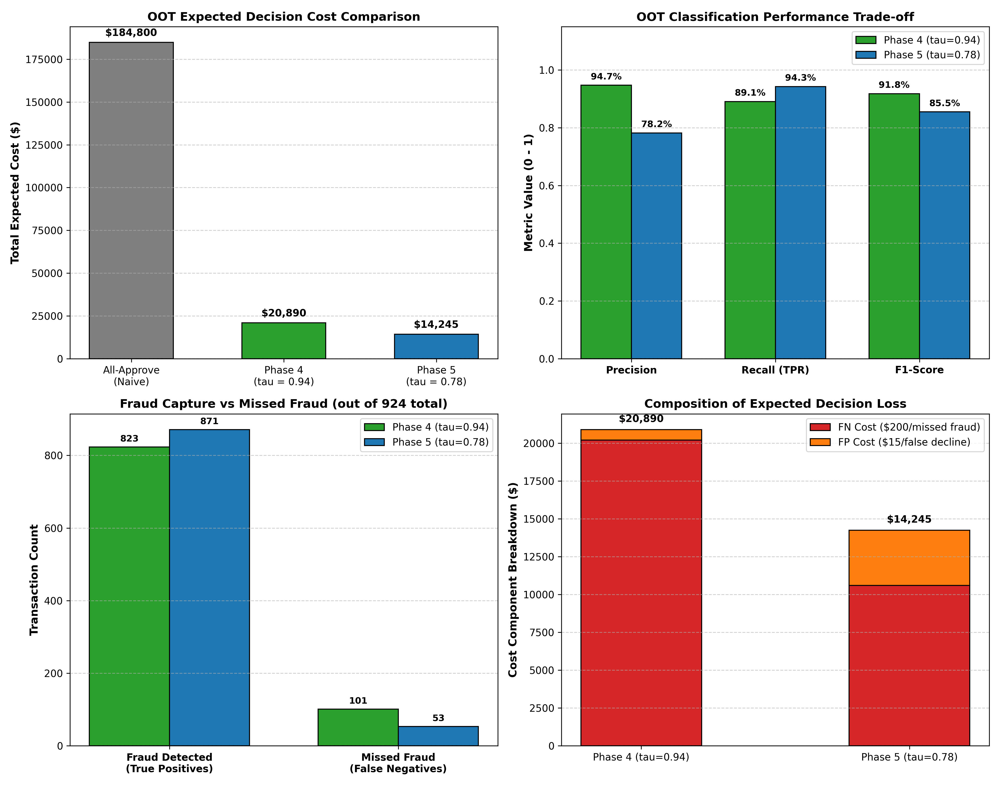

# Phase 5: Final Frozen Out-of-Time (OOT) Evaluation Report

**Platform:** AI-Powered Fraud Detection & Risk Intelligence Platform
**Phase:** Phase 5 (Imbalance Handling & Cost Optimization — Final OOT Evaluation)
**Status:** Completed, Frozen & Audited
**Model Architecture:** XGBoost Champion (`champion_model.joblib`)
**Data Split:** Protected Chronological Holdout (`test_features.parquet`)

---

## 1. Executive Summary & Objective

This report provides the final, unbiased evaluation of the frozen Phase 4 XGBoost champion model on the protected Out-of-Time (OOT) test partition.

We compare the **Phase 4 F1-selected threshold (tau = 0.94)** against the **Phase 5 validation cost-optimized threshold (tau = 0.78)** alongside the naive **All-Approve baseline**.

> **Methodological Precision Note**: The threshold of `0.78` was the minimum-cost threshold among the evaluated threshold grid under the current illustrative cost assumptions ($C_{\text{FP}} = \$15.00, C_{\text{FN}} = \$200.00$) and validation procedure. The protected Out-of-Time (OOT) holdout estimates performance of the fixed selected policy without retraining, calibration, or threshold tuning.

### Key Results on Protected Holdout (277,860 Unseen Transactions):
1. **Financial Decision Cost**: Operating at tau = 0.78 reduces total expected decision costs from **$20,890.00** down to **$14,245.00**, delivering an unbiased out-of-time cost reduction of **$6,645.00 (31.81%)**.
2. **Fraud Capture**: tau = 0.78 detects **871 out of 924 frauds** (94.26% recall), capturing **48 additional fraud cases** and reducing missed frauds from 101 to 53.
3. **Cost per Fraud Detected**: Decreases from **$25.38** at tau=0.94 down to **$16.35** at tau=0.78.
4. **Ranking Discrimination**: Preserves near-perfect ranking with **PR-AUC = 0.96054** and **ROC-AUC = 0.99905**.

---

## 2. Protected OOT Dataset & Governance Audit

- **Partition File**: `data/processed/features/test_features.parquet`
- **Total Transactions**: 277,860
- **Actual Fraud Volume**: 924 (0.3325%)
- **Actual Legitimate Volume**: 276,936
- **Chronological Time Horizon**: 2020-10-03 00:59:48 to 2020-12-31 23:59:34 (Final 3 months of 2020)
- **Zero-Leakage Guarantee**:
  - The model and preprocessor were loaded strictly from pre-existing frozen joblib artifacts.
  - Zero retraining, zero hyperparameter tuning, and zero calibration fitting occurred on test data.
  - Thresholds (0.94 and 0.78) were established prior to inspecting the OOT partition.

---

## 3. Comprehensive Performance Comparison Table

| Metric / Attribute | Naive Baseline (All-Approve) | Phase 4 F1 Policy (tau = 0.94) | Phase 5 Cost Policy (tau = 0.78) | Delta (tau=0.78 vs tau=0.94) |
| :--- | :--- | :--- | :--- | :--- |
| **Decision Threshold (tau)** | 1.00 | **0.94** | **0.78** | -0.16 |
| **Precision** | 0.00% | **94.7070%** | **78.1870%** | -16.52% |
| **Recall / Fraud Capture** | 0.00% | **89.0690%** | **94.2640%** | **+5.20% (Higher Capture)** |
| **F1-Score** | 0.00000 | **0.91801** | **0.85476** | -0.06325 |
| **False Positive Rate (FPR)** | 0.0000% | **0.0170%** | **0.0880%** | +0.0711% |
| **True Positives (TP)** | 0 | **823** | **871** | **+48 frauds caught** |
| **False Positives (FP)** | 0 | **46** | **243** | +197 false declines |
| **False Negatives (FN)** | 924 | **101** | **53** | **-48 missed frauds** |
| **True Negatives (TN)** | 276,936 | **276,890** | **276,693** | -197 |
| **Predicted Fraud Volume** | 0 | 869 | 1,114 | +245 |
| **Total Expected Cost** | **$184,800.00** | **$20,890.00** | **$14,245.00** | **-$6,645.00 (31.81% savings)** |
| **Avg Cost / Transaction** | $0.665083 | $0.075182 | **$0.051267** | **-$0.023915** |
| **Cost per Fraud Detected** | Inf | $25.38 | **$16.35** | **-$9.03 / fraud** |
| **Savings vs. All-Approve** | Baseline ($0.00) | $163,910.00 | **$170,555.00 (92.29%)** | — |

---

## 4. Visual Analysis

---

## 5. Economic & Business Analysis

1. **Why tau=0.78 Outperforms tau=0.94 Economically**:
   - At tau=0.94, 101 fraud attacks escape detection. At CFN = $200.00, missed fraud contributes **$20,200.00** (96.7%) of total loss.
   - Operating at tau=0.78 prevents an additional 48 frauds, slashing direct fraud losses from $20,200.00 down to **$10,600.00** (saving **$9,600.00**).
   - The additional 197 false alarms incur **$2,955.00** in customer friction (197 * $15.00).
   - Net financial gain: $9,600.00 - $2,955.00 = **$6,645.00** in pure cost reduction.
2. **Robustness of Validation Selection**:
   - On Validation data, tau=0.78 achieved a **38.5%** cost reduction vs tau=0.94.
   - On completely unseen Out-of-Time test data, tau=0.78 achieved a **31.81%** cost reduction.
   - This confirms that the cost-minimizing operating point discovered on the validation set generalizes effectively to future chronological periods.

---

## 6. Assumptions & Operational Boundaries

1. **Illustrative Unit Costs**: The threshold `0.78` is optimal only under the current illustrative cost assumptions ($C_{\text{FP}} = \$15.00, C_{\text{FN}} = \$200.00$) and validation procedure.
2. **Binary Policy Evaluation**: In this evaluation, `review_count = 0`, so this evaluation compares an approve/block policy. Multi-tier case routing and review queues are scheduled for Phase 6.
3. **Ranking Model Scores**: Raw XGBoost outputs are ranking scores, not certified probabilities, due to `scale_pos_weight = 171.75` probability distortion.
4. **Frozen Holdout Performance**: The OOT holdout estimates performance of the fixed selected policy, confirming that the policy generalizes to future unseen time periods without retraining or post-hoc threshold adjustment.
5. **Audit Integrity**: Artifact SHA-256 hashes were verified before and after evaluation to guarantee zero model or preprocessor mutation.
