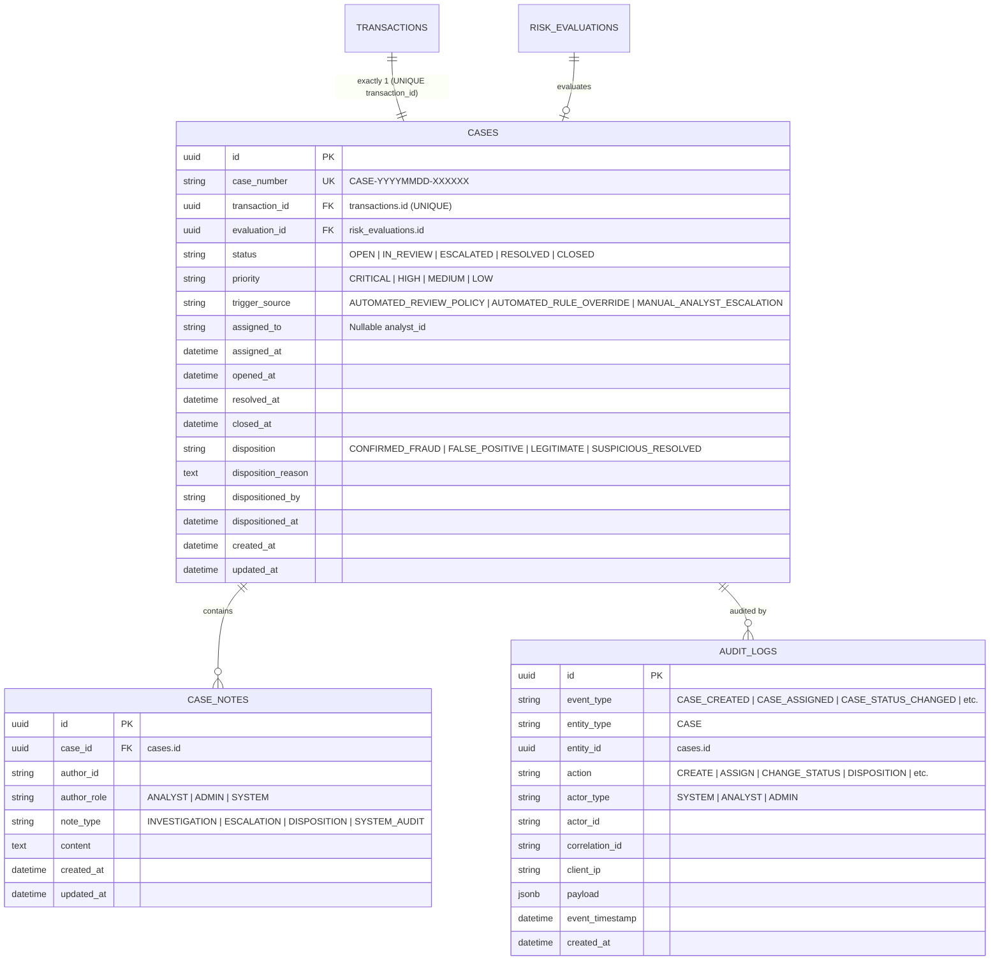
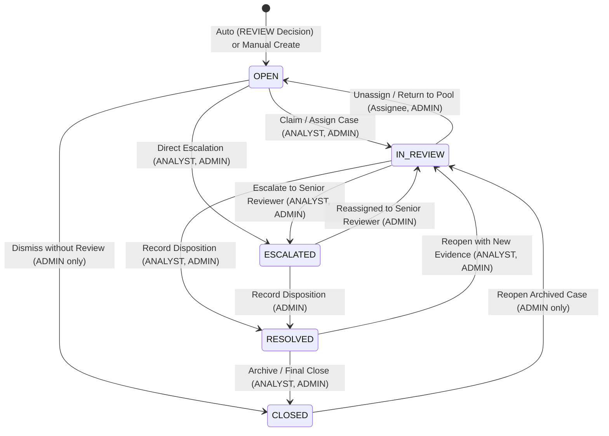

# Phase 12 Architecture & Technical Implementation Plan: Human Review & Case Management (Revised)

> **Platform:** AI-Powered Fraud Detection & Risk Intelligence Platform  
> **Phase:** Phase 12 — Human Review & Case Management  
> **Status:** Planning & Architectural Blueprint (Revised)  
> **Author:** Lead Software Architect & Risk Intelligence Engineer  

---

## Executive Summary

Phase 12 builds an enterprise-grade **Human Review & Case Management** system on top of the established persistence layer (Phase 9) and Fraud Intelligence Dashboard (Phase 11). It allows authorized fraud analysts and risk administrators to triage flagged transactions, claim and investigate review cases with complete ML and explainability context, record immutable investigation notes, execute authoritative human dispositions (`CONFIRMED_FRAUD`, `FALSE_POSITIVE`, `LEGITIMATE`, `SUSPICIOUS_RESOLVED`), and maintain an auditable timeline of all case lifecycle actions.

---

## 1. Repository Audit Findings

An exhaustive repository inspection was performed across backend, persistence, ML engines, frontend dashboard, and testing infrastructure:

### 1.1 Backend & Persistence Architecture
- **FastAPI Core**: Modular application configured in `backend/app/main.py` with lifespan pre-warming of frozen model artifacts and graceful connection pool disposal. Versioned API router mounted at `/api/v1`.
- **Database Engine & Connection Pooling**: SQLAlchemy 2.0 asyncpg engine with QueuePool in `backend/app/db/session.py`. Request-scoped `get_db_session` dependency provides automatic rollback on unhandled exceptions and enforces explicit commit semantics.
- **Active PostgreSQL Tables** (Managed via Alembic revisions `0001_initial_core_tables` and `0002_add_unique_index_external_tx_id`):
  1. `transactions`: Canonical financial transactions, monetary amounts (`Numeric(15, 2)`), 55-feature point-in-time snapshot (`JSONB`), unique partial index on `external_transaction_id`.
  2. `risk_evaluations`: Persisted model scoring results, calibrated 0–100 integer risk score, tri-tier decision action (`APPROVE`, `REVIEW`, `BLOCK`), baseline action, rule override indicators, TreeSHAP base margin and output margin.
  3. `evaluation_rule_matches`: Triggered deterministic business rules linked to evaluations.
  4. `evaluation_reason_codes`: Standardized plain-English reason codes synthesized from TreeSHAP and rules.
  5. `evaluation_feature_attributions`: Local TreeSHAP attributions per predictive feature with direction and contribution percentage.
  6. `audit_logs`: Append-only audit table with polymorphic entity tracking (`entity_type`, `entity_id`), actor telemetry (`actor_type`, `actor_id`), correlation ID, client IP, payload (`JSONB`), and event timestamps.
- **Repository & Service Layer**:
  - Repositories: `TransactionRepository`, `RiskEvaluationRepository`, `RuleMatchRepository`, `ReasonCodeRepository`, `FeatureAttributionRepository`, `AuditLogRepository`, `DashboardRepository`.
  - Unit of Work: `FraudPersistenceUnitOfWork` orchestrates all repositories under a single `AsyncSession` transaction boundary.
  - Persistence Service: `FraudPersistenceService` executes atomic transactional writes for incoming prediction aggregates.

### 1.2 Authentication & Authorization (RBAC) Audit
- **Current State**: Full JWT/OAuth2 user authentication is scheduled on the product roadmap for Phase 15. Currently, the database does not contain a `users` table or session tokens.
- **Audit Enums**: `AuditActorType` already defines `SYSTEM`, `ANALYST`, `ADMIN`, and `API_CLIENT`.
- **Design Resolution**: Phase 12 implements an extensible `ActorContext` dependency in `backend/app/core/auth.py` that maps strictly to the 4 existing `AuditActorType` roles. In development/test environments (`ALLOW_DEV_ACTOR_HEADERS=True`), actor identity is extracted from request headers for local workflow testing. In production (`ALLOW_DEV_ACTOR_HEADERS=False`), client-supplied actor headers are strictly ignored and rejected without a verified token, ensuring zero production vulnerability while maintaining compatibility with Phase 15.

### 1.3 Existing Audit-Log Capabilities
- **Current State**: The `audit_logs` table and `AuditLogRepository` provide an immutable-by-design audit foundation.
- **Design Resolution**: Extended by adding `CASE = "CASE"` to `AuditEntityType`. All case actions stage audit events through the existing `FraudPersistenceUnitOfWork.audit_logs` repository. No duplicate audit system is created.

### 1.4 Frontend Dashboard Architecture (Phase 11)
- **Technology Stack**: React 18 + TypeScript + Vite with a dark-mode glassmorphic design system (`#0B0F19` canvas, `#111827` cards, cyan/emerald/amber/rose risk badges).
- **Existing Components**:
  - `Navbar`: Tabs for `Live Operations` (`operations`), `Analytics & Trends` (`analytics`), `What-If Simulator` (`simulator`), and real-time backend health badge.
  - `LiveTransactionFeed`: Real-time transaction feed with configurable near-real-time polling (5s/10s/30s), filters for decision action and risk tier, and drawer trigger.
  - `TransactionDrawer`: Slide-over drawer displaying 7 feature categories, TreeSHAP waterfall, reason codes, rule matches, and audit trail timeline.
  - `AnalyticsDashboard`: Visualizing risk score distributions (10 buckets), time-series volume trends, and rule effectiveness.
  - `WhatIfSimulator`: Zero-write in-memory counterfactual feature modifier and comparison engine.
- **Client & API Layer**: `frontend/src/api/client.ts` (native fetch wrapper with `ApiClientError`), `dashboardApi.ts`, and typed interfaces in `types/api.ts`.

### 1.5 Test Suite & Build Verification
- **Automated Tests**: 819 / 819 tests passing (100% pass rate, 0 failures, 0 regressions).
- **Frontend Build**: Vite production build transforms 1,610 modules in ~4.9s with 0 TypeScript/compilation errors.
- **Git State**: Clean working tree on `master` at commit `b9105a6`.

---

## 2. Authentication Safety & Environment Security Boundary

### 2.1 Configuration Settings (`backend/app/core/config.py`)
- `ALLOW_DEV_ACTOR_HEADERS: bool = Field(default=False)`:
  - **Development & Test Boundary**: When `True` (enabled strictly in `ENVIRONMENT in ("development", "test")`), allows `X-Actor-ID` and `X-Actor-Role` headers to specify actor context for local dashboard testing, mocking, and automated test fixtures.
  - **Production Security Policy**: When `False` (mandatory in `production`), client-supplied `X-Actor-ID` and `X-Actor-Role` headers are strictly ignored and stripped.
- In production, protected case management mutations require an authenticated identity token (or verified gateway claims), returning HTTP `401 Unauthorized` if unauthenticated.
- This design provides seamless compatibility with Phase 15 JWT implementation without breaking any Phase 12 interface contracts.

### 2.2 Actor Context Dependency (`backend/app/core/auth.py`)
```python
@dataclass(frozen=True)
class ActorContext:
    actor_id: str
    actor_role: AuditActorType
    client_ip: Optional[str] = None
    correlation_id: Optional[str] = None
```
- `get_current_actor(http_request: Request) -> ActorContext`:
  - Evaluates authorization headers according to environment configuration.
  - Validates `actor_role` strictly against `AuditActorType` (`SYSTEM`, `ANALYST`, `ADMIN`, `API_CLIENT`).
- `require_roles(allowed_roles: Sequence[AuditActorType])`:
  - Enforces role authorization server-side, raising HTTP `403 Forbidden` if the authenticated actor lacks required permissions.

---

## 3. Proposed Case Domain Model & Strict 1-to-1 Cardinality



### Strict 1-to-1 Cardinality Governance
- **Uniqueness Guarantee**: Enforced by table constraint `uq_cases_transaction_id` on `cases(transaction_id)`.
- **Reopening Lifecycle**: If a transaction with a resolved or closed case requires subsequent investigation (e.g. late customer dispute or newly discovered evidence), the existing case record is reopened via `REOPEN` status transition (`status -> IN_REVIEW`, `resolved_at -> NULL`, `closed_at -> NULL`). An audit event `CASE_REOPENED` and an investigation note are staged atomically. No duplicate case records are created.

---

## 4. Database & Table Design

### 4.1 Table: `cases`
- `id`: `UUID`, Primary Key, `default=uuid.uuid4`.
- `case_number`: `VARCHAR(32)`, NOT NULL, Unique, Indexed (`CASE-YYYYMMDD-XXXXX`).
- `transaction_id`: `UUID`, NOT NULL, FK `transactions.id` (`ondelete="RESTRICT"`), Unique, Indexed.
- `evaluation_id`: `UUID`, NOT NULL, FK `risk_evaluations.id` (`ondelete="RESTRICT"`), Indexed.
- `status`: `VARCHAR(20)` (`OPEN`, `IN_REVIEW`, `ESCALATED`, `RESOLVED`, `CLOSED`), NOT NULL, default `'OPEN'`, Indexed.
- `priority`: `VARCHAR(16)` (`CRITICAL`, `HIGH`, `MEDIUM`, `LOW`), NOT NULL, default derived from `risk_tier`, Indexed.
- `trigger_source`: `VARCHAR(32)` (`AUTOMATED_REVIEW_POLICY`, `AUTOMATED_RULE_OVERRIDE`, `MANUAL_ANALYST_ESCALATION`), NOT NULL.
- `assigned_to`: `VARCHAR(128)`, Nullable, Indexed (analyst ID).
- `assigned_at`: `TIMESTAMPTZ`, Nullable.
- `opened_at`: `TIMESTAMPTZ`, NOT NULL, default `now()`, Indexed.
- `resolved_at`: `TIMESTAMPTZ`, Nullable.
- `closed_at`: `TIMESTAMPTZ`, Nullable.
- `disposition`: `VARCHAR(32)` (`CONFIRMED_FRAUD`, `FALSE_POSITIVE`, `LEGITIMATE`, `SUSPICIOUS_RESOLVED`), Nullable, Indexed.
- `disposition_reason`: `TEXT`, Nullable.
- `dispositioned_by`: `VARCHAR(128)`, Nullable.
- `dispositioned_at`: `TIMESTAMPTZ`, Nullable.
- `created_at`: `TIMESTAMPTZ`, NOT NULL, default `now()`.
- `updated_at`: `TIMESTAMPTZ`, NOT NULL, default `now()`, onupdate `now()`.

**Indexes & Constraints**:
- `pk_cases`: Primary Key (`id`)
- `uq_cases_case_number`: Unique (`case_number`)
- `uq_cases_transaction_id`: Unique (`transaction_id`)
- `ix_cases_status_priority_created`: Compound index (`status`, `priority`, `created_at` DESC)
- `ix_cases_assigned_status`: Compound index (`assigned_to`, `status`)
- `chk_cases_disposition_state`: Check constraint `(disposition IS NULL) OR (status IN ('RESOLVED', 'CLOSED') AND dispositioned_by IS NOT NULL)`

### 4.2 Table: `case_notes`
- `id`: `UUID`, Primary Key, `default=uuid.uuid4`.
- `case_id`: `UUID`, NOT NULL, FK `cases.id` (`ondelete="CASCADE"`), Indexed.
- `author_id`: `VARCHAR(128)`, NOT NULL, Indexed.
- `author_role`: `VARCHAR(32)` (`ANALYST`, `ADMIN`, `SYSTEM`), NOT NULL, default `'ANALYST'`.
- `note_type`: `VARCHAR(32)` (`INVESTIGATION`, `ESCALATION`, `DISPOSITION`, `SYSTEM_AUDIT`), NOT NULL, default `'INVESTIGATION'`.
- `content`: `TEXT`, NOT NULL.
- `created_at`: `TIMESTAMPTZ`, NOT NULL, default `now()`, Indexed.
- `updated_at`: `TIMESTAMPTZ`, NOT NULL, default `now()`.

**Indexes & Constraints**:
- `pk_case_notes`: Primary Key (`id`)
- `ix_case_notes_case_created`: Compound index (`case_id`, `created_at` ASC)
- `chk_case_notes_content_non_empty`: Check constraint `LENGTH(TRIM(content)) > 0`.

---

## 5. Case Creation Policy, Concurrency & Idempotency

### 5.1 Creation Channels
1. **Automated Trigger (Detection Pipeline)**:
   - Evaluated transactions resulting in `decision_action == DecisionAction.REVIEW` (whether from baseline score $\ge 0.35$ or business rule overrides) atomically construct and stage an initial `OPEN` case in `FraudPersistenceService.persist_evaluation()`.
   - `trigger_source = AUTOMATED_REVIEW_POLICY` (or `AUTOMATED_RULE_OVERRIDE`).
   - Priority derived from `risk_tier`.
   - Stages initial system note and `CASE_CREATED` audit event.
2. **Manual Creation (Analyst Escalation)**:
   - Analysts or administrators can manually create a case for any transaction via `POST /api/v1/cases`.
   - Requires valid `transaction_id` and non-empty `initial_note`.

### 5.2 Transaction / Evaluation Integrity Check
- When creating a case, `CaseService` verifies that `Case.evaluation_id` belongs directly to `Case.transaction_id`.
- If an explicit `evaluation_id` is supplied and belongs to a different transaction, the request is rejected with `PersistenceError` / HTTP `422 Unprocessable Entity` (`detail="Evaluation '{evaluation_id}' does not belong to Transaction '{transaction_id}'."`).
- If omitted, `CaseService` automatically resolves the primary `RiskEvaluation` associated with the transaction.

### 5.3 Concurrency & Idempotency Translation
- **Pre-check**: `CaseService` checks if a case already exists for `transaction_id`. If present, raises `PersistenceConflictError` / HTTP `409 Conflict` returning existing `case_id` and `case_number`.
- **Race Condition Safety**: If two concurrent requests execute `create_case` simultaneously, PostgreSQL `uq_cases_transaction_id` rejects the second write with an `IntegrityError`.
- **Service Translation**: The service catches `IntegrityError`, executes a rollback, queries the winning case, and returns a structured HTTP `409 Conflict` (`detail="A case already exists for transaction '{transaction_id}'."`, `existing_case_id="...", existing_case_number="..."`).
- **Prediction Idempotency**: Repeated `POST /predict` calls for the same `external_transaction_id` hit the established idempotency fast-path in `predict.py`, bypassing aggregate re-staging and preventing duplicate automated case creation.

---

## 6. Case Lifecycle State Machine & RBAC Matrix



### Transition Validation & RBAC Matrix
Strictly enforces the 4 established roles (`SYSTEM`, `ANALYST`, `ADMIN`, `API_CLIENT`):

| Current Status | Target Status | Required Action / Payload | Authorized Roles | Business Rules / Constraints |
| :--- | :--- | :--- | :--- | :--- |
| `OPEN` | `IN_REVIEW` | `CLAIM` | `ANALYST`, `ADMIN` | Self-claim: sets `assigned_to = actor.actor_id`, `assigned_at = now()` |
| `OPEN` | `IN_REVIEW` | `ASSIGN` (`assignee_id`) | `ADMIN` | Supervisor assignment: assigns to specified analyst ID |
| `OPEN` | `ESCALATED` | `ESCALATE` (reason) | `ANALYST`, `ADMIN` | Requires non-empty escalation note |
| `OPEN` | `CLOSED` | `CLOSE_DISMISSED` (reason) | `ADMIN` | Dismissed without review: restricted to Admin; requires note |
| `IN_REVIEW` | `OPEN` | `UNASSIGN` / `RELEASE` | `ANALYST` (assignee), `ADMIN` | Resets `assigned_to = None`, `assigned_at = None` |
| `IN_REVIEW` | `ESCALATED` | `ESCALATE` (reason) | `ANALYST`, `ADMIN` | Requires non-empty escalation note |
| `IN_REVIEW` | `RESOLVED` | `RECORD_DISPOSITION` (disposition, reason) | `ANALYST`, `ADMIN` | Valid disposition enum required; sets `resolved_at = now()` |
| `ESCALATED` | `IN_REVIEW` | `ASSIGN` (`assignee_id`) | `ADMIN` | Admin assigns to senior reviewer |
| `ESCALATED` | `RESOLVED` | `RECORD_DISPOSITION` (disposition, reason) | `ADMIN` | Admin records final disposition on escalated case |
| `RESOLVED` | `CLOSED` | `CLOSE` | `ANALYST`, `ADMIN` | Sets `closed_at = now()` |
| `RESOLVED` | `IN_REVIEW` | `REOPEN` (reason) | `ANALYST`, `ADMIN` | Clears `resolved_at`, appends reopening note |
| `CLOSED` | `IN_REVIEW` | `REOPEN` (reason) | `ADMIN` | Reopening archived closed case restricted to Admin role |

Invalid transitions (e.g. `OPEN` $\to$ `RESOLVED` directly without entering `IN_REVIEW`) are rejected with HTTP `422 Unprocessable Entity`.

---

## 7. Assignment, Notes, and Disposition Models

### 7.1 Assignment Model
- **Self-Claim**: An analyst claims an unassigned case via `PATCH /api/v1/cases/{id}/assignment` with `{ "action": "CLAIM" }`. Sets `assigned_to = actor.actor_id`, `assigned_at = now()`, status $\to$ `IN_REVIEW`.
- **Supervisor Assignment**: An admin assigns a case to a specific reviewer via `{ "action": "ASSIGN", "assignee_id": "analyst_02" }`.
- **Release / Unclaim**: The assigned analyst or an admin releases the case via `{ "action": "UNASSIGN" }`. Sets `assigned_to = None`, `assigned_at = None`, status $\to$ `OPEN`.
- **Reassignment**: Setting a new `assignee_id` when already assigned.

### 7.2 Investigation Notes Model
- **Append-Only Principle**: Notes are strictly append-only in `case_notes`. No `UPDATE` or `DELETE` endpoints exist for analyst notes.
- **Categorization**:
  - `INVESTIGATION`: Findings from cardholder contact, merchant verification, device inspection.
  - `ESCALATION`: Specific rationale explaining why senior escalation is requested.
  - `DISPOSITION`: Summary reasoning recorded when final outcome is submitted.
  - `SYSTEM_AUDIT`: System-generated notes on automated state transitions.
- **Endpoints**: `GET /api/v1/cases/{id}/notes` and `POST /api/v1/cases/{id}/notes`.

### 7.3 Disposition Model
Human dispositions are conceptually distinct from automated ML decisions:
- Automated ML/Rule Decision: `APPROVE`, `REVIEW`, `BLOCK` (immutable in `risk_evaluations`).
- Human Analyst Disposition:
  1. `CONFIRMED_FRAUD`: Fraud confirmed by investigator (account takeover, stolen credentials, synthetic ID).
  2. `FALSE_POSITIVE`: Benign transaction that was incorrectly flagged/escalated by model or rules.
  3. `LEGITIMATE`: Verified legitimate cardholder transaction.
  4. `SUSPICIOUS_RESOLVED`: Suspicious pattern confirmed, but resolved with cardholder (e.g. authorized family member).
- **Submission**: `POST /api/v1/cases/{id}/disposition`
  - Requires `disposition` enum and `disposition_reason` text ($\ge 10$ characters).
  - Automatically transitions status to `RESOLVED`, sets `dispositioned_by = actor.actor_id`, `dispositioned_at = now()`, `resolved_at = now()`.
  - Appends a `DISPOSITION` case note.
  - Emits `CASE_DISPOSITIONED` audit log with bounded payload.

---

## 8. Bounded Audit Payload Policy

To maintain high database performance and prevent unbounded JSONB row bloat, `case_notes` is the **sole authoritative repository** for full note text. `audit_logs.payload` stores strictly bounded operational metadata ($\le 1\text{ KB}$):

| Action | Stored Audit Payload Keys | Size Budget | Authoritative Source for Details |
| :--- | :--- | :--- | :--- |
| `CREATE_CASE` | `case_number`, `transaction_id`, `trigger_source`, `priority` | $< 250\text{ B}$ | `cases` table |
| `ASSIGN_CASE` / `UNASSIGN_CASE` | `action`, `previous_assignee`, `new_assignee` | $< 200\text{ B}$ | `cases` table |
| `UPDATE_STATUS` | `old_status`, `new_status`, `reason_preview` ($\le 150\text{ chars}$) | $< 300\text{ B}$ | `cases` table |
| `ADD_NOTE` | `note_id`, `note_type`, `author_id`, `content_length`, `content_preview` ($\le 100\text{ chars}$) | $< 300\text{ B}$ | `case_notes` table (`content`) |
| `DISPOSITION_CASE` | `disposition`, `disposition_reason_preview` ($\le 200\text{ chars}$), `dispositioned_by` | $< 400\text{ B}$ | `cases.disposition_reason` |
| `CLOSE_CASE` / `REOPEN_CASE` | `reason_preview` ($\le 150\text{ chars}$), `previous_status` | $< 250\text{ B}$ | `cases` table |

---

## 9. Query Optimization & Collection Loading Strategy

Preserves the Phase 11.3 loading strategy to eliminate N+1 queries without generating bloated Cartesian products:

1. **Case Detail Loading (`get_by_id`)**:
   ```python
   select(Case).where(Case.id == case_id).options(
       joinedload(Case.transaction),
       joinedload(Case.evaluation),
       selectinload(Case.notes),
       selectinload(Case.evaluation).selectinload(RiskEvaluation.rule_matches),
       selectinload(Case.evaluation).selectinload(RiskEvaluation.reason_codes),
       selectinload(Case.evaluation).selectinload(RiskEvaluation.feature_attributions),
   )
   ```
   - Uses `joinedload` for 1-to-1 parents (`transaction`, `evaluation`).
   - Uses `selectinload` for 1-to-many child collections (`notes`, `rule_matches`, `reason_codes`, `feature_attributions`).
2. **Review Queue Feed (`get_queue_cases`)**:
   - Queries `cases` joined with `transactions` (for amount, currency, account_id) and `risk_evaluations` (for risk_score, risk_tier) using column-restricted joins.
   - Bulky collections (`features_snapshot`, `feature_attributions`, `rule_matches`, note histories) are **omitted** from queue list items to guarantee sub-millisecond serialization and minimal bandwidth.

---

## 10. Timezone Semantics & Queue Summary Metrics

All database timestamps and aggregations strictly use timezone-aware UTC (`timezone.utc`).

### `CaseSummaryResponse` Schema
- `total_open`: Total in-flight review cases (`status IN ('OPEN', 'IN_REVIEW', 'ESCALATED')`).
- `unassigned_count`: Open cases without an assigned reviewer (`status == 'OPEN' AND assigned_to IS NULL`).
- `in_review_count`: Cases in active investigation (`status == 'IN_REVIEW'`).
- `escalated_count`: Cases escalated to senior review (`status == 'ESCALATED'`).
- `resolved_today`: Count of cases with `resolved_at >= start_of_current_utc_day` (defined as `datetime.now(timezone.utc).replace(hour=0, minute=0, second=0, microsecond=0)`).
- `resolved_last_24h`: Count of cases with `resolved_at >= now_utc - timedelta(hours=24)`.
- `critical_priority_count`: Open or in-review cases with `priority == 'CRITICAL'`.

---

## 11. REST API Endpoint Contracts

All endpoints mounted under `/api/v1/cases`:

1. `GET /api/v1/cases`: Paginated review queue with filtering (`status`, `priority`, `assigned_to`, `risk_tier`, `min_score`, `max_score`, `search_term`, `start_date`, `end_date`, `sort_by`, `sort_order`).
2. `GET /api/v1/cases/summary`: Operational KPI summary for queue header (`total_open`, `unassigned_count`, `in_review_count`, `escalated_count`, `resolved_today`, `resolved_last_24h`, `critical_priority_count`).
3. `GET /api/v1/cases/{case_id}`: Full case investigation aggregate (transaction context, risk evaluation, reason codes, rule matches, TreeSHAP attributions, 55 features, notes, audit timeline).
4. `POST /api/v1/cases`: Manual case creation for any transaction.
5. `PATCH /api/v1/cases/{case_id}/assignment`: Claim, assign, unassign, reassign.
6. `PATCH /api/v1/cases/{case_id}/status`: State transition (`OPEN`, `IN_REVIEW`, `ESCALATED`, `CLOSED`, `REOPEN`).
7. `GET /api/v1/cases/{case_id}/notes`: List all chronological notes.
8. `POST /api/v1/cases/{case_id}/notes`: Append an investigation note.
9. `POST /api/v1/cases/{case_id}/disposition`: Record final human disposition (`CONFIRMED_FRAUD`, `FALSE_POSITIVE`, `LEGITIMATE`, `SUSPICIOUS_RESOLVED`).
10. `GET /api/v1/cases/{case_id}/timeline`: Unified chronological feed of notes and audit events.

---

## 12. Frontend Architecture (Review Queue & Case Workspace)

### 12.1 Review Queue View (`CaseQueue.tsx` & `CaseQueueKPIs.tsx`)
- Tab `Review Queue` (`cases`) added to `Navbar.tsx` with live unassigned badge indicator.
- Metric strip rendering Total Open, Unassigned, In Review, Escalated, Resolved Today (UTC), Critical Priority.
- Filter toolbar: Status pills, Priority dropdown, Assignee selector (`All`, `Assigned to Me`, `Unassigned`), Score/Date range, Search bar, Auto-polling toggle.
- Case Queue Table: Case #, Priority badge, Status badge, Risk score meter, Amount, Account ID, Trigger source, Assignee, Opened time, Action buttons ("Investigate", "Claim").

### 12.2 Case Investigation Workspace (`CaseDetailView.tsx`)
- Header with Case Number, Status, Priority, Assignment chip, Quick Claim/Release.
- Split-panel investigation layout:
  - Left panel: Transaction context, Risk Score Meter, Reason codes, Rule matches, TreeSHAP waterfall, 55 features.
  - Right panel: Human disposition panel (outcome selector, rationale textarea, submit button), Status actions (Escalate, Close, Reopen), Investigation notes timeline + rich input, Case audit trail.

---

## 13. Proposed File Changes

### Files to Create
1. `backend/app/db/models/case.py` (ORM models: `Case`, `CaseNote`)
2. `backend/app/repositories/case_repository.py` (`CaseRepository` implementation with selectinload)
3. `backend/app/schemas/case.py` (Pydantic v2 case schemas)
4. `backend/app/services/case_service.py` (`CaseService` domain logic, integrity validation & audit orchestration)
5. `backend/app/core/auth.py` (`ActorContext`, `get_current_actor`, `require_roles`)
6. `backend/app/api/v1/endpoints/cases.py` (FastAPI case management endpoints)
7. `backend/alembic/versions/0003_add_cases_and_case_notes_tables.py` (Alembic migration)
8. `frontend/src/api/casesApi.ts` (API client)
9. `frontend/src/components/cases/CaseQueueKPIs.tsx`
10. `frontend/src/components/cases/CaseQueue.tsx`
11. `frontend/src/components/cases/CaseNotesPanel.tsx`
12. `frontend/src/components/cases/CaseDispositionModal.tsx`
13. `frontend/src/components/cases/CaseDetailView.tsx`
14. `tests/unit/test_case_models.py`
15. `tests/unit/test_case_schemas.py`
16. `tests/unit/test_case_service.py`
17. `tests/unit/test_case_repository.py`
18. `tests/integration/test_case_api_integration.py`
19. `docs/phase_12/implementation_plan.md`

### Files to Modify
1. `backend/app/db/models/enums.py` (Add `CaseStatus`, `CasePriority`, `CaseDisposition`, `CaseTriggerSource`, `CaseNoteType`, update `AuditEntityType.CASE`)
2. `backend/app/db/models/__init__.py` (Export `Case`, `CaseNote`, new enums)
3. `backend/app/db/models/transaction.py` (Add 1-to-1 relationship to `Case`)
4. `backend/app/db/models/risk_evaluation.py` (Add relationship to `Case`)
5. `backend/app/repositories/__init__.py` (Export `CaseRepository`)
6. `backend/app/services/unit_of_work.py` (Expose `cases: CaseRepository` on UoW)
7. `backend/app/services/persistence_service.py` (Auto-stage `OPEN` case on `REVIEW` decisions)
8. `backend/app/api/v1/router.py` (Mount `cases.router`)
9. `backend/app/repositories/dashboard_repository.py` (Include case status link in transaction detail query)
10. `backend/app/schemas/dashboard.py` (Add optional case link fields in transaction schemas)
11. `frontend/src/components/common/Navbar.tsx` (Add `cases` tab)
12. `frontend/src/App.tsx` (Add case tab routing)
13. `frontend/src/types/api.ts` (Add case TypeScript types)
14. `frontend/src/components/investigation/TransactionDrawer.tsx` (Add "Open Review Case" button)
15. `frontend/src/components/overview/LiveTransactionFeed.tsx` (Render case status badge)
16. `frontend/src/styles/index.css` (Add case styling rules)
17. `tests/conftest.py` (Add `case_notes`, `cases` to TRUNCATE list)

---

## 14. Testing Strategy

1. **Unit Tests**:
   - `test_case_models.py`: Verify table creation, primary keys, foreign keys, unique constraint `uq_cases_transaction_id`, check constraints, cascaded deletes on `case_notes`.
   - `test_case_service.py`: Verify valid state transitions, rejection of invalid transitions, assignment rules, self-claim, release, note appending, disposition recording, auto-case creation on `REVIEW`.
   - `test_case_repository.py`: Verify query filtering, pagination, search, timezone boundary tests for `resolved_today` (UTC midnight boundary) and `resolved_last_24h`.
   - `test_case_schemas.py`: Verify Pydantic v2 validation, enum validations, string boundaries, rejection of extra unknown fields, empty content rejection on notes.
2. **Integration Tests**:
   - `test_case_api_integration.py`: End-to-end API tests for all `/api/v1/cases/*` endpoints.
   - Transaction/Evaluation Mismatch Test: Verify that supplying an `evaluation_id` belonging to a different transaction returns HTTP `422 Unprocessable Entity`.
   - Concurrency Race Test: Verify that concurrent duplicate case creation attempts are caught and translated into HTTP `409 Conflict`.
   - Audit Trail Verification: Verify that every case mutation creates an exact `AuditLog` row with bounded payload ($\le 1\text{ KB}$).
3. **Regression Guarantee**:
   - All existing 819 tests must continue to pass with 0 failures and 0 warnings.
   - Frontend TypeScript compile (`npm run build`) passing with 0 errors.

---

## 15. Documentation Strategy

- `docs/phase_12/implementation_plan.md` (authoritative architectural blueprint).
- `PROJECT_STATUS.md` (update progress table and Phase 12 checklist upon approval and execution).
- `README.md` (document Case Management API endpoints, analyst workflows, and UI features).
- `docs/phase_12_case_management_report.md` (authored upon completion of implementation).

---

## 16. Explicit Scope Exclusions

- **NO** new ML models or model retraining (scheduled for Phase 14).
- **NO** Firebase or external cloud SaaS dependencies.
- **NO** replacement of FastAPI, PostgreSQL, or SQLAlchemy.
- **NO** full OAuth2/JWT provider rewrite (scheduled for Phase 15; Phase 12 implements the extensible `ActorContext` dependency).
- **NO** WebSocket streaming (near-real-time polling pattern established in Phase 11 is preserved).
- **NO** mock-only production implementations.
