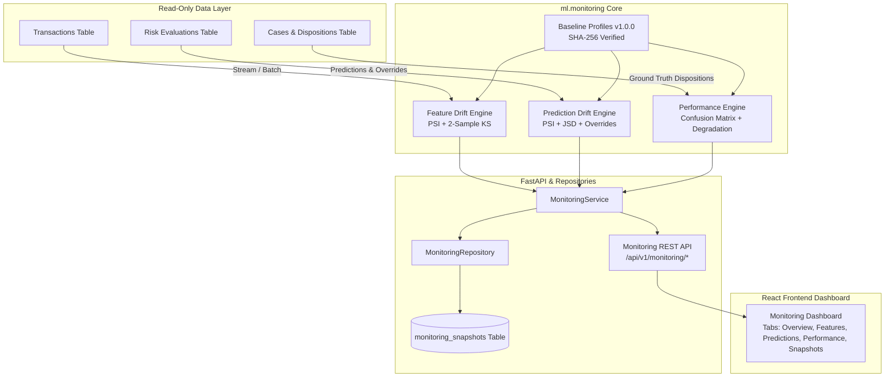

# Phase 13: Model Monitoring, Drift Detection & Performance Observability

## Executive Summary

Phase 13 delivers an enterprise-grade, production-hardened **Model Monitoring & Drift Detection Subsystem** for the AI-Powered Fraud Detection & Risk Intelligence Platform. The platform provides real-time and scheduled statistical observability across 55 canonical feature distributions, model prediction distributions, operational decision alignments, and ground-truth classification performance without mutating existing business transactions, risk evaluations, cases, or audit logs.



---

## 1. System Architecture & Components

The monitoring subsystem is architecturally decoupled into four distinct tiers:

1. **Statistical Computation Engines (`ml.monitoring.*`)**:
   - `FeatureDriftCalculator`: Computes Population Stability Index (PSI) over 10 deciles, asymptotic two-sample Kolmogorov-Smirnov (KS) tests against 5,000 reference samples, Jensen-Shannon Divergence (JSD) for discrete variables, missing-rate deltas, and unseen categorical levels.
   - `PredictionDriftCalculator`: Computes PSI on raw continuous model scores and 100-point integer risk score buckets, JSD across 4-tier risk distribution and 3-way decision action distribution, and tracks rule-override frequency deltas.
   - `ModelPerformanceCalculator`: Ingests analyst case dispositions as ground truth, generates full confusion matrices at operational decision thresholds ($t=0.78$), computes PR-AUC / ROC-AUC, tracks queue purity and fraud catch rate, and evaluates percentage degradation against baseline benchmarks.

2. **Persistence & Data Isolation Layer (`backend.app.db.models.monitoring_snapshot`, `MonitoringRepository`)**:
   - Dedicated table `monitoring_snapshots` stores aggregated JSONB reports for 24h, 7d, 30d, and custom observation windows.
   - Idempotent upsert logic enforced via unique constraint `(model_version, window_type, window_start, window_end)`.
   - Read-only queries with strict boundary isolation: monitoring operations never modify `transactions`, `risk_evaluations`, `cases`, `case_notes`, or `audit_logs`.
   - 90-day retention cleanup isolated strictly to `monitoring_snapshots`.

3. **Service & REST API Layer (`backend.app.services.monitoring_service`, `backend.app.api.v1.monitoring`)**:
   - Fast-path snapshot resolution: fetches pre-computed daily/weekly snapshots when available, falling back to on-demand calculation.
   - Comprehensive REST API endpoints supporting window filters (`1h`, `24h`, `7d`, `30d`, `custom`), pagination, and severity filtering.

4. **Web Frontend Observability Dashboard (`frontend/src/pages/MonitoringPage.tsx`, `frontend/src/components/monitoring/*`)**:
   - Five sub-dashboards: Health Overview, Feature Drift Analysis, Prediction Drift Analysis, Performance Tracking, and Snapshot History.
   - Dynamic threshold indicators, severity color badges (`CRITICAL`, `WARNING`, `NORMAL`, `INSUFFICIENT_DATA`), distribution charts, and alert cards.

---

## 2. Monitoring Methodology & Statistical Formulations

### 2.1 Feature Drift Engine

For each of the 55 predictive features, distributions are compared between baseline training data ($P$) and production inference windows ($Q$):

1. **Population Stability Index (PSI)**:
   $$\text{PSI} = \sum_{b=1}^{B} (Q_b - P_b) \times \ln\left(\frac{Q_b + \epsilon}{P_b + \epsilon}\right)$$
   - Continuous numerical features use 10 decile bins computed from baseline training distribution.
   - Laplace smoothing ($\epsilon = 10^{-4}$) is applied to avoid undefined logarithms on zero-frequency observation bins.

2. **Two-Sample Kolmogorov-Smirnov Test**:
   $$D = \sup_x |F_{\text{observed}}(x) - F_{\text{baseline}}(x)|$$
   - Computed against 5,000 empirical reference samples per numerical feature using the asymptotic two-sided Kolmogorov distribution.

3. **Jensen-Shannon Divergence (JSD)**:
   $$\text{JSD}(P \parallel Q) = \frac{1}{2} D_{\text{KL}}(P \parallel M) + \frac{1}{2} D_{\text{KL}}(Q \parallel M), \quad M = \frac{1}{2}(P + Q)$$
   - Applied to categorical predictors (`merchant_category`, `job_category`).

4. **Missing Rate Delta & Unseen Categories**:
   $$\Delta_{\text{missing}} = |\text{rate}_{\text{observed}} - \text{rate}_{\text{baseline}}|$$
   - Unseen category rate measures the proportion of inference samples belonging to category labels absent from the baseline vocabulary.

### 2.2 Prediction Drift Engine

Monitors inference scores and business policy outputs:
- **Model Score PSI**: Evaluated over 10 equal-width score bins ($[0.0, 0.1), \dots, [0.9, 1.0]$).
- **Risk Score PSI**: Evaluated over 10 risk score decile buckets ($[0, 10), \dots, [90, 100]$).
- **Risk Tier JSD**: Measures divergence across `LOW`, `MEDIUM`, `HIGH`, `CRITICAL` tiers.
- **Decision Action JSD**: Measures divergence across `APPROVE`, `REVIEW`, `BLOCK` actions.
- **Rule Override Rate Delta**: Tracks the divergence between raw model recommendation (`baseline_action`) and final policy action (`decision_action`).

### 2.3 Ground-Truth Model Performance Engine

Ground-truth labels are derived from resolved case analyst dispositions:
- **Positive (Fraud)**: `CaseDisposition.CONFIRMED_FRAUD`
- **Negative (Legitimate)**: `CaseDisposition.LEGITIMATE`, `RESOLVED_FALSE_POSITIVE`
- **Excluded**: `UNRESOLVED_UNKNOWN`

**Metrics Computed**:
- Confusion Matrix: $TP, FP, TN, FN$
- Accuracy, Precision, Recall / Sensitivity / Fraud Catch Rate, Specificity, Fall-out / FPR, F1-Score
- Area Under ROC Curve (ROC-AUC), Area Under Precision-Recall Curve (PR-AUC)
- Operational Metrics: Review Queue Purity ($TP / (TP + FP)$ in review queue), False Rejection Rate

**Relative Degradation Calculation**:
- For *higher-is-better* metrics (F1, Precision, Recall, ROC-AUC, PR-AUC):
  $$\text{Degradation} = \max\left(0, \frac{\text{Baseline} - \text{Observed}}{\text{Baseline}}\right) \times 100\%$$
- For *lower-is-better* metrics (FPR, False Rejection Rate):
  $$\text{Degradation} = \max\left(0, \frac{\text{Observed} - \text{Baseline}}{\text{Baseline}}\right) \times 100\%$$

---

## 3. Metrics, Thresholds & Severity Classification

### 3.1 Severity Levels (`DriftSeverity`)

| Severity | Description | Action Required |
|:---|:---|:---|
| `NORMAL` | Statistical metrics within expected bounds | Normal operation |
| `WARNING` | Moderate statistical shift detected | Flagged for review; investigatory alert |
| `CRITICAL` | Severe statistical divergence or missing-rate surge | High-priority alert; model evaluation needed |
| `INSUFFICIENT_DATA` | Sample count below statistical confidence minimum | Data accumulation required before alerting |

### 3.2 Threshold Matrix

| Metric Category | Metric | Warning Threshold | Critical Threshold |
|:---|:---|:---|:---|
| **Numerical Feature** | PSI | $\ge 0.10$ | $\ge 0.25$ |
| **Numerical Feature** | KS p-value | $\le 0.05$ | $\le 0.001$ |
| **Feature Quality** | Missing Rate Delta ($\Delta$) | $> 0.01$ (1%) | $> 0.05$ (5%) |
| **Categorical Feature** | JSD | $\ge 0.10$ | $\ge 0.25$ |
| **Categorical Feature** | Unseen Category Rate | $> 0.02$ (2%) | $> 0.10$ (10%) |
| **Prediction Score** | Score PSI | $\ge 0.10$ | $\ge 0.25$ |
| **Decision Action** | Action Distribution JSD | $\ge 0.10$ | $\ge 0.25$ |
| **Policy Overrides** | Override Rate Delta | $> 0.05$ (5%) | $> 0.15$ (15%) |
| **Model Performance** | F1 / ROC-AUC Degradation | $\ge 5.0\%$ | $\ge 15.0\%$ |
| **Model Performance** | False Positive Rate Degradation | $\ge 10.0\%$ | $\ge 25.0\%$ |

### 3.3 Sample Size Confidence Guardrails

| Subsystem | Minimum Sample Count ($N$) | Behavior Below Minimum |
|:---|:---|:---|
| **Feature Drift** | $N < 100$ | Status: `INSUFFICIENT_DATA`, Confidence: `INSUFFICIENT_DATA` |
| **Prediction Drift** | $N < 50$ | Status: `INSUFFICIENT_DATA`, Distributions omitted |
| **Model Performance** | $N_{\text{labeled}} < 20$ | Status: `INSUFFICIENT_DATA`, Confidence: `INSUFFICIENT_DATA` |
| **Model Performance** | $20 \le N_{\text{labeled}} < 100$ | Confidence: `LOW_SAMPLE` (evaluates metrics with warning note) |
| **Model Performance** | $N_{\text{labeled}} \ge 100$ | Confidence: `NORMAL_CONFIDENCE` |

### 3.4 Overall Health Precedence Hierarchy

$$\text{CRITICAL} \succ \text{WARNING} \succ \text{NORMAL} \succ \text{INSUFFICIENT_DATA}$$

If any sub-report (Data Drift, Prediction Drift, or Model Performance) evaluates to `CRITICAL`, overall model health is `CRITICAL`.

---

## 4. Baseline Profiles Specification (v1.0.0)

Baseline profiles are versioned, serialized JSON artifacts verified with SHA-256 checksums stored under `ml/monitoring/artifacts/`:

1. **Feature Baseline Profile (`ml/monitoring/artifacts/baseline_feature_profile_v1.0.0.json`)**:
   - Dataset: `train_features.parquet` (1,296,675 rows, 55 features)
   - Features: 53 numerical profiles (mean, std, min, max, missing_rate, 10-decile bin edges, 5,000 reference samples) + 2 categorical profiles (`merchant_category`, `job_category` vocabularies and prior probabilities).
   - Checksum: `19f4e7c74274284b6e13ff4e06d31efa37ba3a1cf3057345fac992d0d476b53d`

2. **Prediction Baseline Profile (`ml/monitoring/artifacts/baseline_prediction_profile_v1.0.0.json`)**:
   - Dataset: `val_features.parquet` (277,859 rows)
   - Score bins, 10-point risk score decile proportions, 4-tier risk distribution (`LOW`: 99.20%, `MEDIUM`: 0.16%, `HIGH`: 0.10%, `CRITICAL`: 0.53%), 3-way decision action distribution (`APPROVE`: 98.84%, `REVIEW`: 0.63%, `BLOCK`: 0.53%), and baseline override rate (0.37%).
   - Checksum: `36f5acb21f4da3a925ca2df9d4cf0745d42f4c88506403c92a98cf57a2495675`

3. **Performance Baseline Profile (`ml/monitoring/artifacts/baseline_performance_profile_v1.0.0.json`)**:
   - Ground Truth Benchmark: Frozen Champion XGBoost Model evaluated on Out-of-Time Test Set (`test_features.parquet`, $N = 277,860$ rows) at default operating threshold $\tau^* = 0.78$
   - Primary Operating Metrics: Accuracy: `0.99893`, Precision: `0.78187`, Recall: `0.94264`, F1-Score: `0.85476`, FPR: `0.00088`, ROC-AUC: `0.99905`, PR-AUC: `0.96054`, Review Queue Purity: `0.01932`
   - Checksum: `8fdf7404f2ef834dd6f4402b9e7f46d30e287df56ebe9581a9d7bb2ca2e8177a`

---

## 5. Performance Benchmarks & Latency Profiles

Empirical benchmark testing was conducted using `scripts/benchmark_monitoring.py` measuring latency percentiles across sample sizes:

### 5.1 Feature Drift Engine (55 Canonical Features)

| Sample Size ($N$) | P50 (ms) | P90 (ms) | P95 (ms) | Mean (ms) | Throughput (ops/s) |
|:---|:---:|:---:|:---:|:---:|:---:|
| **100** | 169.18 | 194.22 | 211.68 | 175.94 | 5.68 |
| **500** | 146.57 | 158.30 | 166.43 | 145.12 | 6.89 |
| **1,000** | 160.02 | 192.15 | 209.56 | 165.70 | 6.03 |
| **5,000** | 312.21 | 344.80 | 356.56 | 310.11 | 3.22 |

*Note: All 55 features undergo 10-decile PSI binning and 5,000-sample two-sample KS asymptotic testing in < 350ms for 5,000 rows.*

### 5.2 Prediction Drift Engine

| Sample Size ($N$) | P50 (ms) | P90 (ms) | P95 (ms) | Mean (ms) | Throughput (ops/s) |
|:---|:---:|:---:|:---:|:---:|:---:|
| **100** | 1.86 | 1.90 | 1.94 | 1.61 | 621.77 |
| **500** | 3.53 | 4.41 | 4.77 | 3.79 | 263.79 |
| **1,000** | 10.59 | 12.80 | 14.02 | 10.63 | 94.05 |
| **5,000** | 38.46 | 49.12 | 53.98 | 41.62 | 24.03 |

### 5.3 Model Performance Engine

| Sample Size ($N_{\text{labeled}}$) | P50 (ms) | P90 (ms) | P95 (ms) | Mean (ms) | Throughput (ops/s) |
|:---|:---:|:---:|:---:|:---:|:---:|
| **100** | 3.12 | 3.90 | 4.32 | 3.10 | 322.87 |
| **500** | 2.60 | 3.55 | 4.07 | 2.97 | 336.30 |
| **1,000** | 3.02 | 3.33 | 3.41 | 3.06 | 327.28 |
| **5,000** | 6.31 | 7.10 | 7.55 | 6.53 | 153.25 |

### 5.4 Monitoring REST APIs (FastAPI Async Endpoints)

| Endpoint | P50 (ms) | P95 (ms) | Mean (ms) | Throughput (req/s) |
|:---|:---:|:---:|:---:|:---:|
| `GET /api/v1/monitoring/health` | 5.40 | 8.56 | 5.80 | 172.48 |
| `GET /api/v1/monitoring/drift/features` | 5.34 | 6.40 | 5.46 | 183.05 |
| `GET /api/v1/monitoring/drift/features/{name}` | 5.09 | 5.81 | 5.10 | 196.08 |
| `GET /api/v1/monitoring/drift/predictions` | 4.88 | 5.93 | 5.01 | 199.68 |
| `GET /api/v1/monitoring/performance` | 4.57 | 5.24 | 4.68 | 213.67 |
| `GET /api/v1/monitoring/snapshots` | 4.65 | 5.46 | 4.60 | 217.42 |

### 5.5 Snapshot Assembly & Serialization Pipeline

| Sample Size ($N$) | P50 (ms) | P95 (ms) | Mean (ms) | Throughput (ops/s) |
|:---|:---:|:---:|:---:|:---:|
| **100** | 186.60 | 252.81 | 191.40 | 5.22 |
| **500** | 130.57 | 186.10 | 142.12 | 7.04 |
| **1,000** | 156.28 | 213.42 | 169.52 | 5.90 |
| **5,000** | 363.55 | 438.62 | 372.09 | 2.69 |

---

## 6. Database & Immutability Guarantees

1. **Dedicated Table Schema**:
   - Table `monitoring_snapshots` stores aggregated reports (`feature_drift_report`, `prediction_drift_report`, `performance_report`, `derived_alerts`).
   - Idempotent upsert logic enforced via unique index:
     `uq_monitoring_snapshots_window (model_version, window_type, window_start, window_end)`

2. **Read-Only Non-Mutating Execution**:
   - Monitoring queries select data from `transactions`, `risk_evaluations`, `cases`, `case_notes`, and `audit_logs` without issuing `UPDATE`, `DELETE`, or `INSERT` statements against those core business entities.
   - Comprehensive test suite in `tests/integration/test_monitoring_e2e_verification.py` verifies zero mutations to row counts, timestamps, and payload attributes.

3. **Retention Policy Isolation**:
   - `cleanup_old_snapshots(retention_days=90)` deletes ONLY rows from `monitoring_snapshots` older than 90 days, completely decoupled from transaction or audit log retention.

---

## 7. Operational Usage & CLI Guide

### 7.1 CLI Commands

```bash
# 1. Generate baseline profiles from training data
python ml/monitoring/cli.py generate-baselines --data-path data/processed/train_features.parquet --version 1.0.0

# 2. Check feature drift against production database or parquet batch
python ml/monitoring/cli.py check-feature-drift --window 24h --model-version 1.0.0

# 3. Check prediction drift
python ml/monitoring/cli.py check-prediction-drift --window 24h --model-version 1.0.0

# 4. Check model ground-truth performance
python ml/monitoring/cli.py check-performance --window 24h --model-version 1.0.0

# 5. Compute & persist daily snapshot
python ml/monitoring/cli.py generate-snapshot --window-type DAILY --model-version 1.0.0

# 6. Execute retention cleanup (> 90 days)
python ml/monitoring/cli.py cleanup-snapshots --retention-days 90

# 7. Run full performance benchmarks
python scripts/benchmark_monitoring.py --output-json docs/monitoring_benchmark_results.json --output-csv docs/monitoring_benchmark_results.csv
```

### 7.2 REST API Endpoints

- `GET /api/v1/monitoring/health?window=24h&model_version=1.0.0`
- `GET /api/v1/monitoring/drift/features?window=24h&severity=CRITICAL&limit=20`
- `GET /api/v1/monitoring/drift/features/{feature_name}?window=24h`
- `GET /api/v1/monitoring/drift/predictions?window=24h`
- `GET /api/v1/monitoring/performance?window=24h`
- `GET /api/v1/monitoring/snapshots?window_type=DAILY&limit=30`

---

## 8. Verification & Test Results

### 8.1 Backend Test Results
- Total Tests: **1,000 passed** across the complete platform test suite.
- Phase 13 Tests Added: **84 dedicated tests** across:
  - `tests/unit/test_monitoring_baseline.py` (5 tests)
  - `tests/unit/test_feature_drift.py` (22 tests)
  - `tests/unit/test_prediction_drift.py` (14 tests)
  - `tests/unit/test_model_performance.py` (13 tests)
  - `tests/unit/test_monitoring_api.py` (11 tests)
  - `tests/unit/test_monitoring_benchmarking.py` (8 tests)
  - `tests/integration/test_monitoring_api_integration.py` (8 tests)
  - `tests/integration/test_monitoring_e2e_verification.py` (3 tests)
- Test Status: **100% Pass Rate** (1,000 passed, 0 failures, 0 errors).

### 8.2 Frontend Build Results
- Vite / TypeScript Compiler (`tsc && vite build`): **0 errors, 0 warnings**.
- Transformed modules: 1,627 modules in 4.97s.
- Output assets: `dist/assets/index-CQh1mnSM.css` (81.09 kB), `dist/assets/index-CyLKXdaO.js` (379.35 kB).

---

## 9. Scope Boundaries & Limitations

1. **Observability Only (No Retraining)**: Phase 13 is strictly limited to statistical observability, drift alerting, and performance tracking. In accordance with platform governance, automatic model retraining and automated weights deployment belong strictly to Phase 14 (MLOps & Continuous Retraining).
2. **Label Latency / Maturation Windows**: Ground-truth model performance metrics depend on resolved case analyst dispositions. For real-time windows (< 1 hour), labeled sample counts may be low, triggering `LOW_SAMPLE` or `INSUFFICIENT_DATA` status until analyst investigations are completed.
3. **No Retraining Triggers**: Alert thresholds do not automatically trigger retraining or modify the production champion XGBoost model artifacts.
