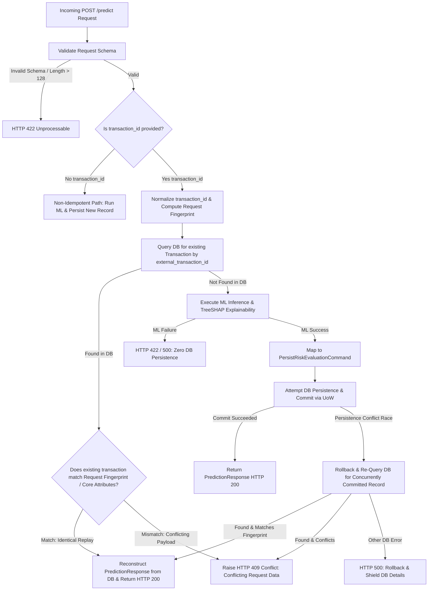

# Phase 9.6 Increment 3 — Idempotency & Duplicate-Request Protection Design

## Executive Summary
This document defines the production-grade idempotency architecture for the `POST /predict` (and `POST /api/v1/predict`) API endpoints in the AI-Powered Fraud Detection & Risk Intelligence Platform.

The design enables safe, deterministic, and database-backed request replays for identical transaction evaluations while strictly rejecting conflicting reuses of external transaction identifiers with `HTTP 409 Conflict`. It eliminates duplicate ML inference, guarantees transactional atomicity across all 6 persisted entities, handles concurrent race conditions, and preserves 100% of the public `PredictionResponse` API contract.

---

## 1. Current-State Analysis & Existing Duplicate Protection

### 1.1 Current Flow in Phase 9.6 Increment 2
In Phase 9.6 Increment 2, inline persistence was integrated into `/predict`:
```text
HTTP Request
  → Request Validation (TransactionPredictRequest)
  → ML Inference & Explainability (RiskService.predict_transaction) [CPU/GPU Bound]
  → Request Context Extraction (RiskEvaluationContext)
  → Persistence Mapping (RiskPersistenceMapper)
  → Persistence Execution (FraudPersistenceService.persist_evaluation)
      → Database Check (exists_by_external_id)
          → If exists: raise PersistenceConflictError
          → If not: insert Transaction, RiskEvaluation, Children, AuditLog
      → uow.commit()
  → Response Serialization (PredictionResponse)
```

### 1.2 Limitations of the Current Behavior
1. **Unconditional 409 on Duplicate Replays**: If a client sends an identical transaction evaluation request (e.g. after a network timeout or automated payment gateway retry), the API returns `HTTP 409 Conflict` instead of the original approved/reviewed/blocked risk decision.
2. **Redundant ML Inference on Replays**: Duplicate checks currently occur *after* the ML gradient boosting and TreeSHAP explainability pass, wasting CPU and latency on requests that will ultimately be rejected.
3. **Concurrency Race Window**: Two identical concurrent requests both pass the pre-inference stage, execute ML inference in parallel, and race to commit; the second request fails with `PersistenceConflictError` (HTTP 409) rather than cleanly receiving the result committed by the first.

---

## 2. Proposed Idempotency Contract

### 2.1 Idempotency Key Definition
* **Field**: `TransactionPredictRequest.transaction_id` (mapped to `transactions.external_transaction_id`).
* **Design Decision**: `transaction_id` serves as the primary external idempotency key. No redundant secondary headers (like `Idempotency-Key`) are required, maintaining API simplicity while aligning with financial ledger conventions where external transaction IDs represent unique payment events.
* **Key Specifications**:
  * **Type**: Alphanumeric string.
  * **Length**: 1 to 128 characters (matching `TransactionPredictRequest.transaction_id` and `transactions.external_transaction_id VARCHAR(128)`).
  * **Normalization**: Stripped of leading and trailing whitespace.
  * **Case Sensitivity**: Case-sensitive (preserving external UUIDs, ULIDs, and gateway transaction IDs).
  * **Validation**: Empty strings or whitespace-only values, as well as strings exceeding 128 characters, are rejected with `HTTP 422 Unprocessable Entity`.
  * **Omitted Key (`None`)**: When `transaction_id` is omitted, requests are treated as **non-idempotent requests with absent external identity**; each submission executes ML inference and persists a new distinct transaction record.

### 2.2 Canonical Request Fingerprint
To distinguish between an **identical replay** and a **conflicting payload** that reuses an existing `external_transaction_id`, the system computes a deterministic SHA-256 fingerprint of the logical financial transaction payload:
* **Included Fields**:
  1. `account_id` (string)
  2. `merchant_id` (string, or `""` if omitted)
  3. `amount` (formatted to 2 decimal places, e.g. `"150.00"`)
  4. `currency` (3-letter uppercase ISO code, e.g. `"USD"`)
  5. `merchant_category` (string)
  6. `job_category` (string)
  7. `city_pop` (integer)
  8. Geographic coordinates (`cardholder_lat`, `cardholder_long`, `merchant_lat`, `merchant_long` formatted to 6 decimal places)
  9. `timestamp` (normalized ISO 8601 string, or `""` if omitted)
  10. All 55 canonical features from `PREDICTIVE_FEATURE_COLUMNS` sorted alphabetically by key.
* **Hash Computation**:
  ```python
  canonical_json = json.dumps(canonical_dict, sort_keys=True, separators=(',', ':'))
  fingerprint = hashlib.sha256(canonical_json.encode('utf-8')).hexdigest()
  ```

---

## 3. Request Lifecycle & Branching Logic



---

## 4. Detailed Behavior Specifications

### 4.1 Same-Key Repeated Request (Identical Replay)
* **Pre-Inference Fast Path**: When a request arrives with an `external_transaction_id` that already exists in the database, the API checks the existing record before running ML inference.
* **Verification**: Compares `account_id`, `merchant_id`, `amount`, `currency`, `merchant_category`, `job_category`, coordinates, timestamp (if provided), and `features_snapshot` against the incoming payload.
* **Action**: If identical:
  1. Reconstructs the complete `PredictionResponse` from the persisted `Transaction`, `RiskEvaluation`, `EvaluationRuleMatch`, `EvaluationReasonCode`, and `EvaluationFeatureAttribution` records.
  2. Bypasses ML inference and TreeSHAP calculations, saving CPU and database writes.
  3. Returns `HTTP 200 OK` with the exact historical evaluation result, including original `evaluated_at` timestamp.
  4. Emits a diagnostic debug/info log: `Idempotent request replay for transaction_id='<id>'`.

### 4.2 Same-Key Conflicting Request (Payload Mutation)
* **Condition**: An incoming request provides an `external_transaction_id` that exists in the database, but one or more attributes (e.g. `account_id`, `amount`, `currency`, `merchant_category`, coordinates, or predictive features) differ from the stored transaction.
* **Action**:
  1. Rejects the request immediately with **`HTTP 409 Conflict`**.
  2. Response detail: `"Transaction with external_transaction_id '<id>' already exists with conflicting request payload."`
  3. Bypasses ML inference and TreeSHAP execution.
  4. Zero database modifications or overwrites occur.

### 4.3 Concurrent Requests & Race Conditions
* **Scenario**: Two identical requests (`Req1` and `Req2`) for `TX_100` arrive concurrently within the same millisecond when no database record yet exists.
* **Resolution**:
  1. Both `Req1` and `Req2` find no existing record in the initial pre-inference check.
  2. Both execute ML inference.
  3. `Req1` acquires the database transaction lock, persists the 6 aggregate entities, and commits successfully.
  4. `Req2` attempts to insert `TX_100` and encounters a `PersistenceConflictError` (via PostgreSQL unique index `uq_transactions_external_tx_id`).
  5. `Req2`'s exception handler performs `uow.rollback()`, re-queries `get_with_evaluations_by_external_id("TX_100")`, finds `Req1`'s committed record, verifies payload equivalence, and returns `Req1`'s `PredictionResponse` with `HTTP 200 OK`.
  6. If `Req2` had conflicting payload data, it returns `HTTP 409 Conflict`.
* **Guarantee**: True database-backed atomicity without single-process in-memory locks, safe across multi-worker Uvicorn and distributed Kubernetes pods.

### 4.4 Failure and Retry Semantics
* **ML Inference Failure**: If model evaluation fails (e.g. invalid feature value), no database transaction is opened. The key remains uncommitted and a subsequent retry proceeds normally.
* **Mapping Failure**: Fails in memory; session is rolled back; key remains uncommitted.
* **Database Commit Failure / Rollback**: If disk I/O or network fails during commit, `uow.rollback()` cleans the session. A subsequent retry can attempt evaluation and persistence cleanly.
* **Process Crash**: If the server crashes mid-request before commit, PostgreSQL rolls back uncommitted rows automatically. A subsequent retry finds no existing record and processes the transaction freshly.
* **Client Timeout After Commit (Unknown Outcome)**: If a client times out after the database commit has succeeded but before receiving the HTTP response, a subsequent retry with the same key and payload enters the pre-inference fast-path, finds the committed record, and returns `HTTP 200 OK` with the original evaluation result.
* **Database Timeout During Commit (Ambiguous Outcome)**: If a database driver encounters a network timeout while waiting for `COMMIT` acknowledgement, the outcome is inherently ambiguous (the commit may or may not have succeeded on the database server). If it succeeded, a retry replays the result. If it failed, a retry re-evaluates and persists the transaction.

---

## 5. Schema & Persistence Model Sufficiency

### 5.1 Verification of Persisted Data
The existing relational schema stores 100% of the data required to reconstruct `PredictionResponse`:

| `PredictionResponse` Field | Relational Storage Location | Type Mapping |
| :--- | :--- | :--- |
| `transaction_id` | `transactions.external_transaction_id` | `Optional[str]` |
| `model_score` | `risk_evaluations.model_score` | `float(Decimal)` |
| `risk_score` | `risk_evaluations.risk_score` | `int` |
| `risk_tier` | `risk_evaluations.risk_tier` | `RiskTier.value` (`str`) |
| `decision_action` | `risk_evaluations.decision_action` | `DecisionAction.value` (`str`) |
| `policy_mode` | `risk_evaluations.policy_mode` | `PolicyMode.value` (`str`) |
| `reason` | `risk_evaluations.decision_reason` | `str` |
| `is_overridden` | `risk_evaluations.is_overridden` | `bool` |
| `rule_action` | `risk_evaluations.rule_action` | `RuleOutcome.value` (`Optional[str]`) |
| `rules_triggered` | `evaluation_rule_matches.rule_id` (derived from ordered matches) | `List[str]` |
| `rule_matches` | `evaluation_rule_matches` rows (ordered by `priority`) | `List[RuleMatchResponse]` |
| `reason_codes` | `evaluation_reason_codes` rows (ordered by `rank`) | `List[ReasonCodeResponse]` |
| `top_risk_factors` | `evaluation_feature_attributions` (direction=`RISK_INCREASING`, ordered by `rank`) | `List[FeatureAttributionResponse]` |
| `top_mitigating_factors` | `evaluation_feature_attributions` (direction=`MITIGATING`, ordered by `rank`) | `List[FeatureAttributionResponse]` |
| `model_version` | `risk_evaluations.model_version` | `Optional[str]` |
| `evaluated_at` | `risk_evaluations.evaluated_at` | `datetime.isoformat()` (`str`) |

### 5.2 Schema Constraint Declarations & Alembic Migration History
* **Partial Unique Index**: The database constraint enforcing uniqueness on non-null external transaction IDs is declared in `Transaction.__table_args__` and formally tracked in Alembic migration `backend/alembic/versions/0002_add_unique_index_external_tx_id.py`:
  ```python
  Index(
      "uq_transactions_external_tx_id",
      "external_transaction_id",
      unique=True,
      postgresql_where=text("external_transaction_id IS NOT NULL"),
      sqlite_where=text("external_transaction_id IS NOT NULL"),
  )
  ```
* **Alembic Migration History**:
  * Revision `0001_initial_core_tables`: Base core tables and foreign key schemas.
  * Revision `0002_add_unique_index_external_tx_id`: `op.create_index("uq_transactions_external_tx_id", "transactions", ["external_transaction_id"], unique=True, postgresql_where=sa.text("external_transaction_id IS NOT NULL"))`.
* **Guarantees**:
  1. Fresh databases initialized via `alembic upgrade head` receive the partial unique index.
  2. Test fixtures using `Base.metadata.create_all` match Alembic migration schema exactly.
  3. No test fixture or runtime code silently mutates database DDL.

### 5.3 Four-Way Timestamp Semantics
To prevent false-positive duplicate payload conflicts during retries with omitted timestamps, the platform maintains strict semantics across 4 distinct timestamp concepts:
1. **Client Transaction Timestamp (`request.timestamp`)**: The external business occurrence time optionally supplied by the client. If provided, verified for equivalence within a 1.0-second tolerance window.
2. **Ingestion Fallback Timestamp (`transactions.transaction_timestamp`)**: Generated via `datetime.now(timezone.utc)` at persistence time when `request.timestamp` is omitted. Because it is an ingestion-time generated fallback, subsequent retries with an omitted timestamp treat the client timestamp as absent external data rather than comparing a new generation timestamp against the stored fallback, guaranteeing deterministic replay without false conflicts.
3. **Evaluation Timestamp (`risk_evaluations.evaluated_at`)**: Point-in-time timestamp when model evaluation occurred; preserved verbatim and returned on replay.
4. **Audit and Ingestion Timestamp (`created_at`)**: System row creation timestamp in the database table.

---

## 6. Security, Privacy & Observability

1. **No Sensitive Data in Logs**:
   - Logs only record `transaction_id`, `account_id` masked or truncated where needed, and operational decision actions.
   - Raw feature vectors and cardholder personal data are NEVER logged.
2. **Deterministic Fingerprinting**:
   - SHA-256 cryptographic hashing prevents hash collision risks.
3. **Audit Trail Preservation**:
   - Idempotent replays reconstruct historical decisions faithfully without creating redundant audit log entries that could distort transaction velocity metrics.

---

## 7. Implementation Plan

1. **Mapper Extension (`RiskPersistenceMapper`)**:
   - Add `compute_request_fingerprint(request: TransactionPredictRequest) -> str`
   - Add `is_payload_equivalent(request: TransactionPredictRequest, existing_tx: Transaction) -> bool`
   - Add `reconstruct_prediction_response(transaction: Transaction, evaluation: RiskEvaluation) -> PredictionResponse`
2. **Repository Extension (`TransactionRepository`)**:
   - Add `get_with_evaluations_by_external_id(external_transaction_id: str) -> Optional[Transaction]` using `selectinload` for child entities.
3. **Persistence Service Method (`FraudPersistenceService`)**:
   - Add `get_existing_evaluation_by_external_id(external_transaction_id: str) -> Optional[Transaction]` for clean dependency access.
4. **Endpoint Wiring (`predict.py`)**:
   - Pre-inference database check for `external_transaction_id`.
   - On match -> immediate replay (`PredictionResponse`, HTTP 200).
   - On mismatch -> immediate conflict (`HTTP 409`).
   - On concurrency race -> rollback, re-query, replay on match or conflict on mismatch.
5. **Test Suite Addition**:
   - Unit tests for fingerprinting, equivalence checking, response reconstruction.
   - Integration tests against PostgreSQL for sequential replays, payload conflict detection, concurrent requests, and session recovery.
