# Phase 6: Risk Engine, Decision Framework & Standard Rule Catalog Report

**Platform:** AI-Powered Fraud Detection & Risk Intelligence Platform
**Phase:** Phase 6 (Risk Engine & Decision Framework — Increments 1 through 6)
**Status:** Completed, Benchmarked & Reconciled
**Champion Model:** XGBoost Champion (`ml/models/artifacts/champion_model.joblib`)
**Evaluation Datasets:** Validation (`val_features.parquet`, $N = 277,859$) & Out-of-Time Test (`test_features.parquet`, $N = 277,860$)

---

## 1. Executive Summary & Objective

Phase 6 implements the **Risk Engine & Decision Framework**, translating continuous machine learning model scores, deterministic business rules, and multi-tier operational policies into immutable, auditable, production-grade fraud risk decisions.

The platform integrates two complementary decision mechanisms:
1. **Probabilistic Risk Scoring & Policy Engine**: Maps continuous XGBoost model scores ($0.0 \le p \le 1.0$) to calibrated $0–100$ integer risk ratings and tri-tier operational actions (`APPROVE`, `REVIEW`, `BLOCK`).
2. **Deterministic Business Rule Engine & Standard Catalog**: Executes domain heuristics and compliance checks to escalate risk tiers, trigger manual review workflows, and signal out-of-distribution behavioral anomalies.

Through a rigorous read-only empirical benchmark and independent reconciliation audit across $555,719$ validation and out-of-time transactions, Phase 6 proves that the revised standard rule catalog:
* **Preserves 100% of the baseline ML strict-blocking behavior** ($\Delta = 0$ False Positives, $\Delta = 0$ False Negatives, $\Delta = 0$ Precision/Recall/F1 score).
* **Eliminates catastrophic false-positive spikes** by reclassifying geographic speed anomalies from hard-blocking rules to passive monitoring rules.
* **Operates as a risk-intelligence and manual-review safety net** rather than an automated blocking mechanism.

---

## 2. Risk Engine Architecture & Decision Pipeline

The Risk Engine architecture is decoupled into immutable, typed layers under [`ml/risk_engine/`](file:///d:/Users/Pranav%20Khadse/Downloads/VIT/Coding/AI-Powered%20Fraud%20Detection%20&%20Risk%20Intelligence%20Platform/ml/risk_engine/):

```mermaid
flowchart TD
    RawTxn["Incoming Transaction Features (55 Predictive Columns)"] --> Preproc["Champion Preprocessor & XGBoost Model"]
    RawTxn --> RuleEng["Rule Engine (Standard Rule Catalog)"]

    Preproc --> MLScore["Continuous ML Score (0.0 to 1.0)"]
    MLScore --> PolicyEng["Decision Policy Engine (TRI_TIER / BINARY_AUTO)"]

    PolicyEng --> BaseDecision["Baseline Decision (APPROVE / REVIEW / BLOCK)"]
    RuleEng --> RuleMatches["Rule Matches (Priority-Sorted, Outcomes: REVIEW / MONITOR)"]

    BaseDecision --> HybridRouter["Hybrid Decision Coordinator & Precedence Router"]
    RuleMatches --> HybridRouter

    HybridRouter --> FinalDecision["Final Risk Decision Payload\n• action: APPROVE | REVIEW | BLOCK\n• risk_score: 0 to 100\n• risk_tier: LOW | MEDIUM | HIGH\n• overridden: bool\n• rule_action: REVIEW | None\n• reason_codes: Tuple[ReasonCode, ...]\n• rule_triggers: Tuple[RuleMatch, ...]"]
```



### 2.1 Core Types & Data Contracts

* **`DecisionPolicyConfig`**: Immutable configuration defining `policy_mode` (`TRI_TIER` vs `BINARY_AUTO`), `review_threshold` ($\tau_{\text{rev}} = 0.35$), `block_threshold` ($\tau_{\text{blk}} = 0.78$), `min_score` ($0$), and `max_score` ($100$).
* **`RiskRule`**: Immutable rule definition containing `rule_id`, `feature_name`, `operator` (`>`, `<`, `==`, `!=`, `>=`, `<=`, `in`, `is_true`), `comparison_value`, `outcome` (`BLOCK`, `REVIEW`, `MONITOR`), `rule_type` (`VELOCITY`, `AMOUNT`, `GEOGRAPHY`, `COMPLIANCE`), `priority` ($1–100$), and `description`.
* **`RuleMatch`**: Immutable match provenance recording `rule_id`, `outcome`, `feature_name`, `operator`, `comparison_value`, `actual_value`, and `priority`.
* **`RiskDecision`**: Immutable evaluation result recording `transaction_id`, `model_score`, `risk_score`, `risk_tier`, `action`, `overridden`, `rule_action`, `reason_codes`, and `rule_triggers`.

### 2.2 Rule Precedence & Overrides Framework

The hybrid decision coordinator applies strict deterministic precedence:

1. **Precedence Hierarchy**:
   $$\text{BLOCK} \succ \text{REVIEW} \succ \text{APPROVE} \succ \text{MONITOR}$$
2. **Protected Model Blocks**: If the baseline ML policy classifies a transaction as `BLOCK` ($p \ge 0.78$), lower-tier rule outcomes (`REVIEW` or `MONITOR`) **never downgrade** the decision. The transaction remains `BLOCK` with `overridden = False`.
3. **Escalation to Review**: If the baseline ML decision is `APPROVE` ($p < 0.35$) and a `REVIEW` rule matches, the final action escalates to `REVIEW` with `overridden = True` and `rule_action = DecisionAction.REVIEW`.
4. **Passive Monitoring**: `MONITOR` rules capture provenance and anomaly metadata (`rule_triggers`) but **produce 0 direct action overrides**.

---

## 3. Standard Rule Catalog Specification

The standard rule catalog is defined in [`ml/risk_engine/catalog.py`](file:///d:/Users/Pranav%20Khadse/Downloads/VIT/Coding/AI-Powered%20Fraud%20Detection%20&%20Risk%20Intelligence%20Platform/ml/risk_engine/catalog.py) and exposed via `get_standard_rule_catalog()`:

| Priority | Rule ID | Outcome | Feature | Operator | Comparison Value | Rule Type | Business Objective |
| :---: | :--- | :---: | :--- | :---: | :---: | :---: | :--- |
| **30** | `RULE_VELOCITY_BURST_REVIEW` | `REVIEW` | `txn_count_1h` | `>` | `4.0` | Velocity | Escalates card velocity bursts ($>4$ txns/hour) to manual review. |
| **40** | `RULE_AMT_ZSCORE_DEVIATION_REVIEW` | `REVIEW` | `amount_zscore` | `>` | `5.0` | Amount | Escalates extreme individual spending deviations ($>5\sigma$) to review. |
| **50** | `RULE_AMT_EXTREME_MONITOR` | `MONITOR` | `amount` | `>` | `5000.0` | Amount | Monitors high-value transactions without automated disruption. |
| **50** | `RULE_COMPLIANCE_LARGE_AMOUNT_MONITOR` | `MONITOR` | `amount` | `>` | `3000.0` | Compliance | Audit logging for anti-money laundering / regulatory thresholds. |
| **60** | `RULE_GEO_IMPOSSIBLE_TRAVEL_MONITOR` | `MONITOR` | `is_impossible_travel_speed` | `is_true` | `True` | Geography | Flags impossible travel speeds ($>1000\text{ km/h}$) for analyst inspection. |
| **70** | `RULE_GEO_EXTREME_DISTANCE_MONITOR` | `MONITOR` | `cardholder_merchant_distance_km` | `>` | `140.0` | Geography | Tracks 99th percentile upper-tail geographic distance outliers. |

### 3.1 Core Purpose of the Standard Catalog

The rule catalog is explicitly designed as a:
* **Risk-Intelligence Layer**: Annotates transactions with deterministic risk metadata and audit trails.
* **Explainable Manual-Review Escalation Layer**: Safely routes edge-case anomalies to human fraud analysts without automated customer friction.
* **Monitoring & Anomaly-Signaling Layer**: Identifies compliance thresholds and behavioral anomalies for downstream investigation.
* **Safety-Net Mechanism**: Protects against potential ML model blind spots on rare out-of-distribution inputs.

> [!IMPORTANT]
> The standard rule catalog is **not** a replacement for the champion XGBoost model. It functions exclusively as a defense-in-depth operational safety net.

---

## 4. Empirical Benchmark & Reconciliation Findings

The revised standard catalog was evaluated across both the Validation dataset ($N = 277,859$) and the Out-of-Time Test dataset ($N = 277,860$) under `TRI_TIER` ($\tau_{\text{rev}}=0.35, \tau_{\text{blk}}=0.78$) and `BINARY_AUTO` ($\tau_{\text{blk}}=0.78$).

### 4.1 Action Distribution & Override Reconciliation

$$\text{APPROVE} + \text{REVIEW} + \text{BLOCK} = N_{\text{total}}$$

| Dataset | Policy Mode | Pipeline Stage | APPROVE | REVIEW | BLOCK | Total Sum | Overridden Rows | Protected Blocks |
| :--- | :--- | :--- | :---: | :---: | :---: | :---: | :---: | :---: |
| **Validation** | **TRI_TIER** | Baseline ML | 275,659 (99.21%) | 726 (0.26%) | 1,474 (0.53%) | 277,859 | — | — |
| | | Hybrid Catalog | 274,631 (98.84%) | 1,754 (0.63%) | 1,474 (0.53%) | 277,859 | **1,028** (APPROVE $\to$ REVIEW) | 622 |
| | **BINARY_AUTO** | Baseline ML | 276,385 (99.47%) | 0 (0.00%) | 1,474 (0.53%) | 277,859 | — | — |
| | | Hybrid Catalog | 275,186 (99.04%) | 1,199 (0.43%) | 1,474 (0.53%) | 277,859 | **1,199** (APPROVE $\to$ REVIEW) | 622 |
| **OOT Test** | **TRI_TIER** | Baseline ML | 276,129 (99.38%) | 617 (0.22%) | 1,114 (0.40%) | 277,860 | — | — |
| | | Hybrid Catalog | 275,090 (99.00%) | 1,656 (0.60%) | 1,114 (0.40%) | 277,860 | **1,039** (APPROVE $\to$ REVIEW) | 466 |
| | **BINARY_AUTO** | Baseline ML | 276,746 (99.60%) | 0 (0.00%) | 1,114 (0.40%) | 277,860 | — | — |
| | | Hybrid Catalog | 275,567 (99.17%) | 1,179 (0.42%) | 1,114 (0.40%) | 277,860 | **1,179** (APPROVE $\to$ REVIEW) | 466 |

---

### 4.2 Strict-Blocking Invariance Guarantee

**Definition**: Positive = `BLOCK`, Negative = `APPROVE` or `REVIEW`.

Under strict-blocking evaluation, baseline ML decisions and hybrid decisions are **mathematically identical**:

$$\Delta \text{TP} = 0, \quad \Delta \text{FP} = 0, \quad \Delta \text{FN} = 0, \quad \Delta \text{TN} = 0, \quad \Delta \text{F1} = 0.00000$$

| Dataset | Policy Mode | Pipeline Stage | TP | FP | FN | TN | Precision | Recall | F1 Score |
| :--- | :--- | :--- | :---: | :---: | :---: | :---: | :---: | :---: | :---: |
| **Validation** | **TRI_TIER & BINARY_AUTO** | Baseline ML | 1,160 | 314 | 61 | 276,324 | 0.78697 | 0.95004 | 0.86085 |
| | | Hybrid Catalog | 1,160 | 314 | 61 | 276,324 | 0.78697 | 0.95004 | 0.86085 |
| | | **Delta** | **0** | **0** | **0** | **0** | **0.00000** | **0.00000** | **0.00000** |
| **OOT Test** | **TRI_TIER & BINARY_AUTO** | Baseline ML | 871 | 243 | 53 | 276,693 | 0.78187 | 0.94264 | 0.85476 |
| | | Hybrid Catalog | 871 | 243 | 53 | 276,693 | 0.78187 | 0.94264 | 0.85476 |
| | | **Delta** | **0** | **0** | **0** | **0** | **0.00000** | **0.00000** | **0.00000** |

> [!NOTE]
> Because the catalog contains no hard-blocking rules and protects all baseline ML `BLOCK` outcomes, automated transaction blocking is 100% determined by the champion XGBoost model.

---

### 4.3 Full-Intervention Performance Metrics

**Definition**: Positive = `BLOCK` or `REVIEW` (any non-approval friction), Negative = `APPROVE`.

| Dataset | Policy Mode | Pipeline Stage | TP | FP | FN | TN | Precision | Recall | F1 Score |
| :--- | :--- | :--- | :---: | :---: | :---: | :---: | :---: | :---: | :---: |
| **Validation** | **TRI_TIER** | Baseline ML | 1,188 | 1,012 | 33 | 275,626 | 0.54000 | 0.97297 | 0.69453 |
| | | Hybrid Catalog | 1,191 | 2,037 | 30 | 274,601 | 0.36896 | 0.97543 | 0.53540 |
| | | **Delta** | **+3** | **+1,025** | **-3** | **-1,025** | **-0.17104** | **+0.00246** | **-0.15913** |
| | **BINARY_AUTO** | Baseline ML | 1,160 | 314 | 61 | 276,324 | 0.78697 | 0.95004 | 0.86085 |
| | | Hybrid Catalog | 1,166 | 1,507 | 55 | 275,131 | 0.43621 | 0.95495 | 0.59887 |
| | | **Delta** | **+6** | **+1,193** | **-6** | **-1,193** | **-0.35076** | **+0.00491** | **-0.26198** |
| **OOT Test** | **TRI_TIER** | Baseline ML | 900 | 831 | 24 | 276,105 | 0.51993 | 0.97403 | 0.67797 |
| | | Hybrid Catalog | 903 | 1,867 | 21 | 275,069 | 0.32599 | 0.97727 | 0.48890 |
| | | **Delta** | **+3** | **+1,036** | **-3** | **-1,036** | **-0.19394** | **+0.00324** | **-0.18907** |
| | **BINARY_AUTO** | Baseline ML | 871 | 243 | 53 | 276,693 | 0.78187 | 0.94264 | 0.85476 |
| | | Hybrid Catalog | 877 | 1,416 | 47 | 275,520 | 0.38247 | 0.94913 | 0.54523 |
| | | **Delta** | **+6** | **+1,173** | **-6** | **-1,173** | **-0.39940** | **+0.00649** | **-0.30953** |

---

## 5. Review-Queue Dynamics & Concentration Analysis

A fundamental empirical finding of the reconciliation audit is the clear distinction between **individual rule match concentration** and **combined review queue purity**:

### 5.1 Review Queue Concentration Decomposition Table

| Metric / Dimension | Validation Dataset (TRI_TIER) | Out-of-Time Test Dataset (TRI_TIER) | Out-of-Time Test Dataset (BINARY_AUTO) |
| :--- | :---: | :---: | :---: |
| **`RULE_AMT_ZSCORE` Population Fraud Conc.** | **22.4337%** (389 / 1,734) | **20.4413%** (315 / 1,541) | **20.4413%** (315 / 1,541) |
| **`RULE_VELOCITY_BURST` Population Fraud Conc.** | **16.6667%** (2 / 12) | **12.0690%** (7 / 58) | **12.0690%** (7 / 58) |
| **Baseline Review Queue Fraud Conc. (Precision)** | **3.8567%** (28 / 726) | **4.7002%** (29 / 617) | 0.0000% (0 / 0) |
| **Newly Added Review Rows (Overrides)** | 1,028 rows | 1,039 rows | 1,179 rows |
| **Frauds in Newly Added Review Rows** | 3 frauds | 3 frauds | 6 frauds |
| **Legitimate in Newly Added Review Rows** | 1,025 legits | 1,036 legits | 1,173 legits |
| **Newly Added Review Fraud Concentration** | **0.2918%** (3 / 1,028) | **0.2887%** (3 / 1,039) | **0.5089%** (6 / 1,179) |
| **Final Combined Hybrid Review Queue Conc.** | **1.7674%** (31 / 1,754) | **1.9324%** (32 / 1,656) | **0.5089%** (6 / 1,179) |
| **Review Queue Concentration Delta** | **-2.0893%** (Dilution) | **-2.7678%** (Dilution) | N/A (New Queue Created) |

### 5.2 Architectural Explanation for Review Queue Dilution

Why does a rule with $20.44\%$ population fraud concentration yield only $0.29\%$ concentration when applied to the review queue?

1. **Model Absorption**: In the OOT test partition, `RULE_AMT_ZSCORE_DEVIATION_REVIEW` matches $1,541$ transactions containing $315$ frauds.
2. **Model Prioritization**: Of those $315$ frauds, **$308$ frauds ($97.78\%$)** were already assigned high risk scores ($p \ge 0.78$) by the XGBoost model and were **already in the `BLOCK` tier** ($413$ total matched rows).
3. **Existing Review Overlap**: An additional **$4$ frauds** were already assigned moderate scores ($0.35 \le p < 0.78$) in the baseline `REVIEW` tier ($140$ total matched rows).
4. **Marginal Diverted Population**: Only **$3$ frauds** (and $985$ legitimate transactions) were assigned low scores ($p < 0.35$) in the baseline `APPROVE` tier.
5. **Conclusion**: The catalog does **not** increase the precision of the review queue; it **dilutes** review queue purity (from $4.70\%$ down to $1.93\%$) to catch rare, low-scoring fraud edge cases.

---

## 6. Decision Cost Reconciliation

**Cost Parameters**: False Positive ($C_{\text{FP}} = \$15.00$), False Negative ($C_{\text{FN}} = \$200.00$), Manual Review ($C_{\text{REV}} = \$5.00$).

### 6.1 Blocking-Loss Plus Review-Cost View (View A)
* Formulation: $\text{Total Cost} = (FP_{\text{strict}} \times \$15) + (FN_{\text{strict}} \times \$200) + (N_{\text{REVIEW}} \times \$5)$

| Dataset | Policy Mode | Baseline Cost | Hybrid Cost | Cost Delta (\$) | Cost Delta (%) |
| :--- | :--- | :---: | :---: | :---: | :---: |
| **Validation** | **TRI_TIER** | \$20,540.00 | \$25,680.00 | **+\$5,140.00** | **+25.02%** |
| | **BINARY_AUTO** | \$16,910.00 | \$22,905.00 | **+\$5,995.00** | **+35.45%** |
| **OOT Test** | **TRI_TIER** | \$17,330.00 | \$22,525.00 | **+\$5,195.00** | **+29.98%** |
| | **BINARY_AUTO** | \$14,245.00 | \$20,140.00 | **+\$5,895.00** | **+41.38%** |

### 6.2 Full-Intervention View (View B)
* Formulation: $\text{Total Cost} = (FP_{\text{interv}} \times \$15) + (FN_{\text{interv}} \times \$200) + (N_{\text{REVIEW}} \times \$5)$

| Dataset | Policy Mode | Baseline Cost | Hybrid Cost | Cost Delta (\$) | Cost Delta (%) |
| :--- | :--- | :---: | :---: | :---: | :---: |
| **Validation** | **TRI_TIER** | \$25,410.00 | \$45,325.00 | **+\$19,915.00** | **+78.37%** |
| | **BINARY_AUTO** | \$16,910.00 | \$39,600.00 | **+\$22,690.00** | **+134.18%** |
| **OOT Test** | **TRI_TIER** | \$20,350.00 | \$40,485.00 | **+\$20,135.00** | **+98.94%** |
| | **BINARY_AUTO** | \$14,245.00 | \$36,535.00 | **+\$22,290.00** | **+156.48%** |

### 6.3 Interpretation of Modeled Cost Increases

Under static benchmark modeling, total expected cost increases (+29.98% in OOT TRI_TIER) because the model accounts for the human labor cost of manual review ($+\$5.00$ per review) **without factoring in downstream fraud recovery value**.

In live production operations, the economic viability of the review tier depends on factors beyond static cost curves:
* **Analyst Review Effectiveness**: The proportion of fraudulent reviews correctly identified and blocked by human investigators.
* **Recovered Fraud Dollar Value**: High-value transactions ($> \$3,000$) represent larger loss prevention opportunities than the average $\$200$ unit penalty.
* **Operational SLA & Capacity**: The available full-time analyst hours and queue processing velocity.
* **Customer Friction Costs**: The brand and churn impact of delayed transaction fulfillment during manual review.

---

## 7. Assumptions, Known Limitations & Production Recommendations

### 7.1 Known Limitations

1. **Static Unit Cost Assumptions**: Fixed penalties ($C_{\text{FP}}=\$15, C_{\text{FN}}=\$200, C_{\text{REV}}=\$5$) treat all transactions identically regardless of transaction monetary amount.
2. **Provisional Geographic Threshold**: The $140.0\text{ km}$ distance threshold is an empirical 99th-percentile heuristic. While it triggers consistently on $\approx 0.10\%$ of transactions, real-world deployments require merchant-category-aware distance baselines.
3. **Analyst Queue Sizing**: Increasing review volume from $617 \to 1,656$ transactions requires sufficient operational capacity to prevent review backlog SLA breaches.

### 7.2 Production Recommendations

1. **Deploy in Pilot / Shadow Mode**: Enable the revised standard rule catalog in shadow mode to capture review queue operational timings and measure true analyst conversion rates.
2. **Dynamic Review Sizing**: If analyst capacity is constrained, adjust the amount z-score threshold from $> 5.0$ to $> 7.0$ to reduce review queue volume while retaining extreme tail risk coverage.
3. **Proceed to Phase 7**: Leverage TreeSHAP explainability in Phase 7 to attach local feature attribution waterfalls to all transactions escalated to the review queue.

---

## 8. Artifact & Integrity Verification

All model artifacts, preprocessors, and datasets were verified for immutability:

```text
Frozen Model Checksums:
5598fc3c9267c3fc14efe83cefd4678bb1fd42fef966200fccd69fd37508611d  ml/models/artifacts/champion_model.joblib
24f4783cdb0141ff13fb1f1036f6dc5d15c32002f915cb33964489c65594231b  ml/models/artifacts/champion_preprocessor.joblib

Frozen Dataset Checksums:
999bdf4324810d9343a54beaa9f653da1ba4cd7430a51caaf19197afc45ffa92  data/processed/features/val_features.parquet
a03446cae9c9ca2dd5fed5265647a08ccf58f18999c7d4ec441845511ea83cf3  data/processed/features/test_features.parquet
589ec61b20624a9c07893ae4366b44aad1eded7300806a13ffa8d76969969eb3  data/processed/features/train_features.parquet
```
